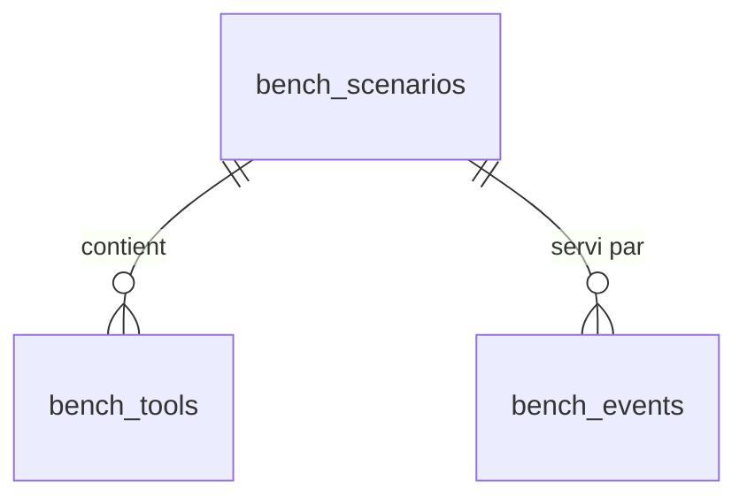
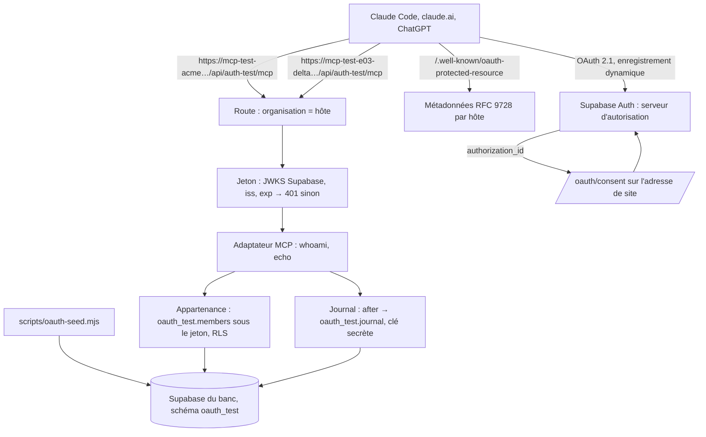

# Architecture — MCP Bench

**Dernière MAJ :** 2026-09-23

## 1. Vue d'ensemble

```mermaid
graph TB
    CC[Claude Code] --> R
    CD[Claude Desktop / Cowork] --> R
    CW[claude.ai] --> R
    GPT[ChatGPT] --> R
    INS[MCP Inspector] --> R
    R[/api/mcp  Streamable HTTP stateless/] --> SNAP[Snapshot par requête : scénario actif + tools]
    SNAP --> H[mcp-handler créé par requête]
    H --> TL[tools/list : lignes bench_tools transformées par le levier readme]
    H --> TC[tools/call : dispatch par handler echo / whoami / mutate / readme]
    R --> EV[Journal : after() → bench_events]
    SNAP --> DB[(Supabase Postgres)]
    TC --> DB
    EV --> DB
    SEED[scripts/bench-seed.mjs] --> DB
    STUDIO[Supabase Studio] --> DB
```

Aucune interface web propre au banc. Aucune IA serveur.

## 2. Stack technique

| Techno | Version | Rôle | Justification |
|--------|---------|------|---------------|
| Next.js | 15 (App Router) | Framework | Route handler `/api/[transport]` |
| TypeScript | ~5.8.3 (strict) | Typage | Épinglé 5.8.x (hangs tsc en 5.9) |
| Supabase | Cloud, projet `nwdmkehnxvqyxddgogtu` | Postgres | Tables du banc, Studio comme admin |
| @supabase/supabase-js | 2.x | Client serveur | Accès aux tables avec la clé secrète (ADR-002) |
| supabase (CLI, devDependency) | latest | Migrations | `db:push`, `db:types` |
| @modelcontextprotocol/sdk | épinglé sur le peer de mcp-handler (réf. 1.26.0) | Serveur MCP | Handlers bas niveau `tools/list`, `tools/call`, `sendToolListChanged` |
| mcp-handler | 1.x (réf. 1.1.0) | Endpoint MCP Next.js | Streamable HTTP, stateless (ADR-001) |
| Zod | 3.x | Validation | Schéma de `bench_mutate` uniquement |
| Vitest | 3.x | Tests | `InMemoryTransport` plus repository mémoire |
| pnpm | 12.x | Package manager | Fichier `packageManager` |

Non installés (hors scope MVP) : jose, @modelcontextprotocol/ext-apps, vite, @supabase/ssr, redis.

## 3. Structure du projet

```
src/
├── app/
│   ├── api/[transport]/route.ts      # Endpoint /api/mcp : snapshot → handler → journal
│   ├── (dashboard)/                  # Template (inchangé)
│   └── design-system/                # Template (inchangé)
├── mcp/
│   ├── config.ts                     # serverInfo par défaut (snapshot vide), secret ack (S03), plafonds
│   ├── server.ts                     # Assemblage : options depuis le snapshot, handlers bas niveau
│   └── bench/
│       ├── repository.ts             # Interface BenchRepository + SupabaseBenchRepository + MemoryBenchRepository
│       ├── snapshot.ts               # loadSnapshot(repo) : scénario actif + tools activés
│       ├── registry.ts               # dispatch tools/call par handler, gardes ack / gate
│       ├── levers.ts                 # rows → Tool[] (JSON Schema brut) + applyLever : fonctions pures, sans import runtime
│       ├── context.ts                # BenchRequestContext, outcomes par requestId (évite le cycle registry → handlers → levers)
│       ├── ack.ts                    # makeAck / verifyAck (HMAC SHA-256, fenêtre TTL)
│       ├── events.ts                 # parse JSON-RPC → BenchEventInsert[] ; logEvents(repo) ; outcomes
│       ├── repository.memory.ts      # implémentation mémoire (tests)
│       └── handlers/
│           ├── echo.ts
│           ├── whoami.ts
│           ├── mutate.ts
│           └── readme.ts
├── lib/
│   ├── schemas/bench-mutate.ts       # Zod : input de bench_mutate
│   └── supabase/admin.ts             # createClient(url, SUPABASE_SECRET_KEY) — serveur uniquement (ADR-002)
└── types/database.ts                 # généré par supabase gen types
scripts/
├── smoke-mcp.mjs                     # initialize + tools/list + bench_whoami + bench_echo + mutate contre une URL
├── bench-seed.mjs                    # pousse le catalogue en base (idempotent par slug), restaure baseline, jamais is_active
└── lib/
    ├── probes.mjs                    # SOURCE UNIQUE des 4 sondes et du scénario baseline (les migrations n'amorcent)
    └── catalogue.mjs                 # catalogue des scénarios + générateur de canaris (testé par vitest)
supabase/
├── config.toml
└── migrations/
docs/bench/
├── protocol.md
└── results.md
```

## 4. Modèle de données



### Tables

**bench_scenarios**

| Colonne | Type | Nullable | Default | Description |
|---------|------|----------|---------|-------------|
| id | uuid | non | gen_random_uuid() | |
| slug | text | non | | Unique. Ex. `baseline`, `desc_len_8k`, `readme_ack` |
| notes | text | oui | | Ce que le scénario mesure |
| server_name | text | non | 'mcp-bench' | `serverInfo.name` |
| server_title | text | oui | | `serverInfo.title` |
| server_version | text | non | '1.0.0' | `serverInfo.version`, incrémentée par `bench_mutate` |
| instructions | text | non | '' | Instructions serveur |
| readme_content | text | oui | | Renvoyé par `bench_readme` |
| readme_lever | text | non | 'none' | check in (none, instructions, descriptions, name_first, gate, ack, hub) |
| ack_ttl_seconds | int | oui | | Fenêtre de validité de l'ack et du gate ; nul = illimité |
| is_active | bool | non | false | Index unique partiel `where is_active` |
| created_at, updated_at | timestamptz | non | now() | |

**bench_tools**

| Colonne | Type | Nullable | Default | Description |
|---------|------|----------|---------|-------------|
| id | uuid | non | gen_random_uuid() | |
| scenario_id | uuid | non | | FK bench_scenarios on delete cascade |
| name | text | non | | Unique par scénario |
| title | text | oui | | |
| description | text | non | '' | |
| input_schema | jsonb | non | '{"type":"object","properties":{}}' | JSON Schema servi tel quel |
| annotations | jsonb | oui | | readOnlyHint, etc. |
| handler | text | non | 'echo' | check in (echo, whoami, mutate, readme) |
| enabled | bool | non | true | |
| version | int | non | 1 | Incrémentée à chaque update |
| sort_order | int | non | 0 | Ordre dans `tools/list` |
| created_at, updated_at | timestamptz | non | now() | |

**bench_events**

| Colonne | Type | Nullable | Default | Description |
|---------|------|----------|---------|-------------|
| id | bigint identity | non | | |
| ts | timestamptz | non | now() | |
| scenario_slug | text | oui | | Scénario servi (dénormalisé) |
| server_version | text | oui | | |
| method | text | non | | initialize, notifications/initialized, tools/list, tools/call, ping, autre |
| rpc_id | text | oui | | id JSON-RPC |
| client_name | text | oui | | `params.clientInfo.name` (initialize) |
| client_version | text | oui | | |
| protocol_version | text | oui | | params ou en-tête `Mcp-Protocol-Version` |
| user_agent | text | oui | | |
| ip | text | oui | | `x-forwarded-for` premier élément |
| session_id | text | oui | | En-tête `Mcp-Session-Id` (nul en stateless) |
| tool_name | text | oui | | tools/call |
| args | jsonb | oui | | tools/call, tronqué à 8 ko |
| tools_served | int | oui | | tools/list |
| response_chars | int | oui | | tools/list : longueur de `JSON.stringify(tools)` |
| list_changed_sent | bool | oui | | bench_mutate |
| is_error | bool | non | false | |
| error_text | text | oui | | |

Index : `bench_events (ts desc)`, `bench_events (user_agent, ip, ts)`, `bench_tools (scenario_id, sort_order)`.

### RLS Policies

| Table | Policy | Opération | Condition |
|-------|--------|-----------|-----------|
| bench_scenarios | RLS activé, aucune policy | toutes | Aucun accès anon/authenticated ; serveur via clé secrète (ADR-002) |
| bench_tools | RLS activé, aucune policy | toutes | idem |
| bench_events | RLS activé, aucune policy | toutes | idem |

## 5. Server Actions

N/A : aucune interface web. Les mutations passent par `bench_mutate` (tool, Zod) et `scripts/bench-seed.mjs`.

## 6. Canal MCP

### Cycle d'une requête

1. La route clone le body, le parse en JSON-RPC (objet ou batch).
2. `loadSnapshot(repo)` lit le scénario actif et ses tools activés (aucun cache).
3. `createMcpHandler` est appelé **par requête** avec `serverInfo` et `instructions` du snapshot et `capabilities.tools.listChanged = true`.
4. Le callback d'init pose deux handlers bas niveau sur `server.server` : `ListToolsRequestSchema` renvoie `applyLever(snapshot)` ; `CallToolRequestSchema` dispatche par `handler`. Aucun `registerTool` (il installerait ses propres handlers).
5. La réponse est renvoyée ; `after()` (next/server) journalise les événements. Échec du journal = `console.error`, jamais une erreur MCP. Les handlers de tools renseignent un `outcome` par `rpc_id` (`list_changed_sent`, `is_error`, `error_text`) que la route fusionne dans les événements `tools/call` avant écriture (S03).
6. GET et DELETE ne chargent pas de snapshot : journalisés comme `http:GET` / `http:DELETE` (le host tente d'ouvrir le flux SSE) puis 405 (S03).

### Tools

| Tool | Input | Effet | Widget | Parcours |
|------|-------|-------|--------|----------|
| bench_whoami | `{note?, ack?}` | Lecture : scénario, version, en-têtes, tools servis, hashes ; `note` = tag host/modèle du testeur, renvoyé et journalisé | N/A | 4.2 |
| bench_echo | `{message?, ack?, ...}` | Lecture : renvoie les arguments | N/A | 4.2 |
| bench_mutate | Zod `bench-mutate.ts` | Écriture : tools et instructions du scénario actif, bump version, tentative `list_changed` | N/A | 4.1 |
| bench_readme | `{}` | Lecture : `readme_content` + ack | N/A | 4.3 |
| tools générés | libre | Lecture : echo | N/A | 4.2 |

Les sondes sont des lignes `bench_tools` avec `handler` non-echo : leurs nom, titre et description sont donc eux aussi des variables de test.

### Leviers readme (`levers.ts`, fonction pure)

| Levier | Effet sur `tools/list` et instructions |
|--------|----------------------------------------|
| none | Aucun |
| instructions | Instructions préfixées : « ALWAYS call bench_readme before any other tool of this server, once per conversation. » |
| descriptions | Descriptions non-readme préfixées : « Requires bench_readme first (call it once per conversation before this tool). » |
| name_first | Readme renommé `bench_00_readme`, `sort_order` forcé en tête |
| gate | Liste inchangée ; `tools/call` non-readme rejeté sans événement readme récent de la même empreinte (user_agent, ip) dans `ack_ttl_seconds` (défaut 1800). L'empreinte est fournie par l'appelant : le gate est un instrument de mesure, pas un contrôle d'accès (ADR-002) |
| ack | Propriété requise `ack` ajoutée à chaque tool non-readme ; `tools/call` vérifie `verifyAck` |
| hub | Descriptions non-readme remplacées par « <name>: see bench_readme for usage. » |

### Ack

`ack = base32(HMAC_SHA256(BENCH_ACK_SECRET, scenario_id + sha256(readme_content) + window))[0..12]` avec `window = floor(now / ack_ttl_seconds)` ou `0` si TTL nul. Vérification : fenêtre courante ou précédente. Aucun état serveur.

### Widgets

N/A.

### Auth MCP

Phase 1 : aucune (ADR-002) ; `/api/mcp` reste public. E03 : serveur auth-test séparé, protégé par OAuth 2.1 avec Supabase (§10, ADR-004).

## 7. Auth & Sécurité

- Endpoint public. Aucune donnée personnelle stockée hors user-agent et IP du host (données techniques, purgeables).
- Aucun middleware : toute route `/api/*` est publique par construction ; chaque handler ajouté porte sa propre auth (mcp-patterns §6 bis).
- Clé secrète Supabase uniquement dans `src/lib/supabase/admin.ts`, jamais importée par un composant client, jamais préfixée `NEXT_PUBLIC_`.
- `BENCH_ACK_SECRET` requis en production : absent = erreur explicite au premier usage.
- `bench_mutate` : validation Zod, noms de tools limités à `^[a-zA-Z0-9_.-]{1,255}$`, descriptions plafonnées à 100 ko, schéma JSON plafonné à 64 ko.
- Arguments d'un tool echo plafonnés à 64 ko ; `args` journalisés tronqués à 8 ko.
- Pas de rate limiting (banc personnel, URL non publiée) : accepté par ADR-002.

## 8. Infrastructure & Déploiement

- **Hébergement :** Vercel, projet `mcp-test` (https://mcp-test-navy.vercel.app), auto-deploy sur push de `main`.
- **Supabase :** Cloud, projet `nwdmkehnxvqyxddgogtu`, région par défaut.
- **CI/CD :** GitHub Actions `pnpm build` uniquement (existant). Migrations poussées en local (`pnpm db:push`), pas de workflow migrations (écarté : rien ne casse sans lui aujourd'hui).
- **Environnements :** local (`.env.local`) et production. Pas de staging.
- **Variables Vercel (production) :** `NEXT_PUBLIC_SUPABASE_URL`, `SUPABASE_SECRET_KEY`, `BENCH_ACK_SECRET` (S03). `NEXT_PUBLIC_SITE_URL` et `MCP_RESOURCE_URL` ne sont lues par aucun code en phase 1 : E03 ne les lit pas non plus : tout se déduit de l'hôte appelé (§10).
- **Préversion E03 :** branche `e03-oauth`, deux domaines `*.vercel.app` rattachés à la branche, exception de protection, variables de préversion (§10.8).

## 9. Serveur proto — maquette de la plateforme (E04)

Second serveur MCP du dépôt, sans lien de code avec le banc : il reprend la cible des deux docs d'architecture ([fonctionnelle](https://claude.ai/artifact/Hjg9VEJ5EMwtDu8nqJ7PYg), [technique](https://claude.ai/artifact/Dumt9aN5erv1eGtiPq14ZK)) au plus court, pour la mesurer. Le banc (`/api/mcp`, tables `bench_*`) reste intact.

### 9.1 Vue d'ensemble

```mermaid
graph TB
    H[Claude Code, claude.ai, ChatGPT] -->|/api/proto/u/jb/mcp| R[Route : utilisateur du segment]
    H -->|/api/proto/u/jb-delta/mcp| R
    R --> A[Adaptateur MCP : six outils préfixés, prompts]
    A --> S[Services : ctx, context, routing, find, read, write, call, feedback]
    S --> F[Catalogue de fonctions : table.*, sellsy.*, mail.*, slack.*, probe.*]
    S --> DB[(Supabase du banc, schéma proto)]
    F --> DB
    A --> J[Journal : after() → proto.journal]
    SEED[scripts/proto-seed.mjs] --> DB
```

Aucune IA serveur, aucun embedding, aucun appel réseau sortant : les connecteurs sont simulés sur des données déterministes.

### 9.2 Structure

```
src/app/api/proto/u/[user]/[transport]/route.ts  # POST : résout l'utilisateur, handler par requête, journal ; GET/DELETE 405
src/proto/
├── schemas.ts          # Zod (zod/v4) : entrées des six outils ; z.toJSONSchema sert l'inputSchema
├── db.ts               # type ProtoDb (client injecté : getProtoClient() d'admin.ts ou client de test), must/many/one
├── result.ts           # ServiceResult et ProtoError (refus actionnable rendu au modèle)
├── identity.ts         # slug → { org, user, teams } ; erreur si inconnu
├── services/
│   ├── ctx.ts          # émettre et vérifier un code ctx
│   ├── context.ts      # blocs par priorité, budget, rendu texte
│   ├── routing.ts      # proto.route_candidates → mélange, bonus, décision seuil + écart
│   ├── find.ts  read.ts  write.ts  call.ts  feedback.ts
│   └── journal.ts      # entrées de journal, flush
├── functions/
│   ├── registry.ts     # catalogue : nom, connecteur, classe (read, write, sensitive), schéma Zod, exemples, handler
│   ├── table.ts        # table.rows, aggregate, write, claim, release, schema
│   └── simulated.ts    # sellsy, mail, slack, probe (fixtures en tête de fichier)
└── mcp/
    ├── tools.ts        # six définitions par préfixe : nom, description, inputSchema
    └── server.ts       # handlers bas niveau tools/list, tools/call, prompts/list, prompts/get
scripts/lib/proto-data.mjs   # SOURCE UNIQUE des données Acme et Delta
scripts/lib/proto-seed.mjs   # seedProto(client, { suffix }) : script et tests
scripts/lib/env.mjs          # lecture de .env.local hors Next (scripts proto, tests)
scripts/proto-seed.mjs       # pnpm proto:seed (remplace les orgs acme et delta)
src/types/proto-database.ts  # écrit à la main au format gen types (jeton de gestion révoqué, pas de Docker)
```

L'ordre du futur paquet est tenu : schémas, services, adaptateur. Un service reçoit `(identity, input)` et rend `{ text }` ou une erreur nommée ; l'adaptateur ne fait que vérifier le ctx, appeler, journaliser et mettre en forme.

### 9.3 Modèle de données (schéma `proto`)

Toutes les tables portent `org_id` (directement ou par leur nœud) avec `on delete cascade` : supprimer une organisation efface tout, ce que les tests font à la fin.

| Table | Colonnes clés | Rôle |
|-------|---------------|------|
| orgs | slug unique, name, prefix unique (`^[a-z][a-z0-9]{1,11}$`), domains (null = description de context sans domaines, mesure 6), topics jsonb `[{subject, path}]`, rules_version int | Un client |
| teams | org_id, slug, name, lead_user_id, rules text, connectors jsonb `{connecteur: read\|write}` | Une équipe et ses droits sur les connecteurs |
| users | org_id, slug unique global (`^[a-z0-9-]{2,40}$`, segment d'URL), name, role (admin, member), default_team_id, profile jsonb `{langue, ton, preferences}` | Une personne |
| team_members | team_id, user_id | Appartenance |
| nodes | org_id, team_id null (null = nœud d'organisation), path unique par org, title, summary ≤ 200, kind (page, procedure, table), status (draft, published), revision (0 = jamais publié), sections jsonb `[{title, body}]`, draft jsonb null `{sections, title, summary, triggers, neighbors, base_revision}`, meta jsonb (table : columns, key, state_column, states ; procédure : suggested), updated_by, updated_at | Pages, procédures, tableaux |
| node_versions | node_id, revision, title, summary, sections, author, created_at | Historique : `read` depuis une révision, nouveautés |
| triggers | node_id, phrase, sense (trigger, neighbor), norm (généré : `proto.norm(phrase)`), tsv (généré : `to_tsvector('proto.fr', phrase)`) ; index GIN trigrammes sur norm et GIN sur tsv | Phrases d'une procédure |
| vocabulary | org_id, term, synonyms text[] | Sigles et synonymes ajoutés à la requête |
| rows | node_id, key unique par tableau, values jsonb, provenance jsonb `{colonne: {origin, by, at, reason}}`, claimed_by, lease_until, revision | Lignes d'un tableau, file de travail |
| mail_drafts | id `dr_…`, org_id, user_id, to_addr, subject, body, status (draft, sent), sent_at | État du connecteur mail simulé |
| ctx | code pk (`XXXX-XXXX`), org_id, user_id, rules_version, user_agent, created_at | Code de contexte |
| journal | ts, org_id, user_id, team_id, ctx, method, tool, target (fonction ou chemin), args (2 ko max), args_chars, result_chars, is_error, error, duration_ms, client_name, user_agent | Le journal fait foi |
| feedback | id (numéro de ticket), org_id, user_id, ctx, type (friction, gap, error), text | Signalements |

`proto.norm(text)` = `lower(unaccent(text))`, déclarée immutable ; `proto.fr` = configuration plein texte `french` avec `unaccent` avant `french_stem`. Extensions `unaccent` et `pg_trgm` dans le schéma `extensions`.

**RLS et accès** (ADR-003) : RLS activée sur les 13 tables, aucune policy ; `usage` et privilèges accordés à `service_role` seulement, révoqués à `anon` et `authenticated` ; `proto` ajouté aux schémas exposés de PostgREST par la migration `20260923090100_proto_expose.sql` (`alter role authenticator set pgrst.db_schemas`), faute de jeton pour l'API de gestion. ⚠️ Ce réglage en base prime sur le tableau de bord : changer les schémas exposés dans le tableau de bord n'a plus d'effet, reprendre la liste de la migration. Les droits d'équipe sont appliqués par les services.

### 9.4 Contrat des six outils

Noms = `<prefix>_<outil>` calculés par requête depuis l'organisation de l'utilisateur. Descriptions en anglais, < 1 000 caractères ; les cinq outils autres que context commencent par « Requires the ctx code from <prefix>_context; call it first. ». Instructions serveur : une phrase qui renvoie à context (elles ne portent rien de vital, mesuré en E01).

| Outil | Entrées (plates) | Rend |
|-------|------------------|------|
| context | `phrase?` | code ctx + blocs par priorité, ≤ 20 000 caractères |
| find | `ctx, query, type?` (procedure, page, table, function) | 3 candidats avec score ; sans `type`, jusqu'à 3 fonctions en plus ; un nom de fonction exact est toujours en tête (avec ou sans `type`) |
| read | `ctx, path, section?, outline?, since_revision?, draft?` ; `path` = chemin de nœud ou nom de fonction | en-tête + contenu, plan, section, changements ; contrat d'une fonction |
| write | `ctx, path, base_revision?, title?, summary?, kind?, ops?, triggers?, neighbors?, publish?` | révision, sections touchées, ou refus avec l'état actuel |
| call | `ctx, function, arguments?` (objet libre), `confirm?` | résultat, ou récapitulatif à faire approuver |
| feedback | `ctx, type, text` | numéro de ticket |

**Vérification du ctx**, avant tout service : code absent ou inconnu, ou d'un autre utilisateur → « Missing or unknown ctx. Call <prefix>_context first and pass its ctx code. » ; `rules_version` différente de celle de l'organisation → « context has changed: call <prefix>_context again with the same request, then retry this call. » (formulation issue de la mesure 5 sur claude.ai et ChatGPT : le modèle rappelait context avec la question du tour et ne rejouait pas l'appel).

**Résultat** : `content[0].text` et `structuredContent.text` portent la même chaîne ; les erreurs sont en texte seul avec `isError`.

**Budget de context** : blocs dans l'ordre code et candidats, étapes de la procédure reconnue, personne, organisation (sections du nœud `guide`), équipe, nouveautés, procédures utiles (60), documents récents (20), pointeurs par sujet (15). Le rendu ajoute les blocs dans cet ordre tant que le total reste sous le budget ; le premier bloc qui dépasse est coupé à la ligne, les suivants sont omis, et une dernière ligne dit ce qui a été omis.

**Routage** : `proto.route_candidates(org, query, kind, limit)` en SQL (migration `20260923130000_proto_route_v2.sql`) rend, par nœud publié hors `guide`, les **composantes** : similarité de trigrammes avec les phrases déclencheuses et avec les voisines (`similarity` et `word_similarity`), avec le titre, part des lexèmes de la requête d'origine trouvés dans les phrases, le titre et le résumé (requête enrichie par les termes dont un synonyme y figure à frontière de mot), nombre de lexèmes de la requête. `src/proto/services/routing.ts` filtre la lecture, mélange (0,55 × max(phrases, titre) + 0,45 × lexèmes, part lexicale atténuée sous deux lexèmes, écart retiré si une voisine est plus proche qu'une déclencheuse), ajoute les bonus équipe et usage (+0,03 chacun) et décide : étapes servies si le premier dépasse **0,65** et devance le deuxième de **0,1**. Seuil et écart calibrés le 2026-09-23 sur 132 phrases (le départ du doc fonctionnel, 0,85 et 0,2, ne servait aucune paraphrase) ; chiffres en tête de `routing.ts`, preuve dans `tests/integration/proto-routing.test.ts`. Limite connue : une négation (« ne relance pas les devis ») est reconnue comme la demande, l'accord demandé avant tout envoi couvre ce cas. `find` appelle la même fonction avec son `type`, et cherche les fonctions du catalogue dans le code (S04).

**Droits** : nœud d'organisation lisible par tous les membres, modifiable par les admins ; nœud d'équipe lisible et modifiable par ses membres et les admins. Une fonction de connecteur s'exécute sous la première équipe de l'utilisateur (l'équipe par défaut d'abord) qui a le droit requis (read pour la classe read, write pour write et sensitive) ; sinon refus nommant l'équipe qui l'a et son responsable. Les fonctions `table.*` suivent les droits du nœud du tableau.

**Confirmation** : une fonction `sensitive` sans `confirm: true` ne s'exécute pas et rend un récapitulatif nominatif avec la consigne de demander l'accord de l'utilisateur.

**Prompts suggérés** (capacité `prompts`, mesure 2) : un prompt par procédure publiée, lisible et marquée `meta.suggested` ; nom = dernier segment du chemin, message = sa première phrase déclencheuse.

**Journal** : l'adaptateur empile une entrée par requête traitée (initialize, tools/list, tools/call, prompts/*) ; la route les écrit dans `after()`. Un échec du journal ne change jamais la réponse.

### 9.5 Tests

Les services parlent au vrai Postgres (plein texte, trigrammes, cascades) : les preuves tournent contre le Supabase du banc, sur des organisations jetables (`seedProto(client, { suffix })`, slugs suffixés), supprimées en fin de fichier. Fichiers `tests/integration/proto-*.test.ts`, sautés avec un message explicite si `.env.local` n'a pas les clés. La preuve 8 (noms, descriptions) est un test unitaire sans base. Pas de repository mémoire : il aurait dupliqué le SQL qu'on veut justement éprouver.

### 9.6 Sécurité

Endpoint public sans authentification (ADR-003) ; données fictives uniquement. Arguments d'un appel plafonnés à 1 Mo (mesure 4), `probe.payload` à 200 000 caractères (mesure 3), `args` journalisés tronqués à 2 ko. Aucune fonction n'accepte un secret.

## 10. Serveur auth-test — authentification des assistants (E03)

Troisième serveur MCP du dépôt, sans lien de code avec le banc ni avec le proto : il met en œuvre au plus court l'hypothèse « Connexion et identité » du [doc technique](https://claude.ai/artifact/Dumt9aN5erv1eGtiPq14ZK) pour la prouver ou la réfuter (ADR-004). Le banc (`/api/mcp`) et le proto (`/api/proto/*`) restent intacts.

### 10.1 Vue d'ensemble



### 10.2 Structure

```
src/app/api/auth-test/[transport]/route.ts                        # POST : hôte → organisation (404), withMcpAuth (401 + WWW-Authenticate de l'hôte), handler par requête, journal ; GET/DELETE 405
src/app/.well-known/oauth-protected-resource/[[...path]]/route.ts # métadonnées RFC 9728 par hôte, racine et variante suffixée ; 404 hôte inconnu
src/app/(auth)/layout.tsx, login/page.tsx, login-form.tsx         # starter supabase-auth, connexion seulement
src/app/(auth)/oauth/consent/page.tsx, actions.ts, consent-form.tsx, consent-journal.ts  # consentement du serveur OAuth Supabase (groupe (auth) pour son layout ; URL inchangée)
src/app/(auth)/auth-test/grants/page.tsx, actions.ts, revoke-button.tsx  # clients autorisés, révocation, déconnexion
src/components/scope-list.tsx                                     # liste des scopes (consentement, clients autorisés)
src/middleware.ts                                                 # session Supabase sur /login, /oauth/*, /auth-test/* seulement ; X-Frame-Options: DENY
src/lib/supabase/server.ts                                        # starter (cookies) ; client.ts non créé : aucun composant client ne parle à Supabase
src/lib/actions/auth.ts, src/lib/schemas/auth.ts                  # login, logout ; loginSchema, safeRedirect, loginPath, consentPath
src/auth-test/
├── db.ts             # OauthTestDb ; userClient(token) : clé publique + Authorization Bearer (RLS)
├── orgs.ts           # normalizeHost, requestHost, resolveOrg (hôte → organisation), isMember (sous le jeton)
├── token.ts          # makeVerifyToken({ jwks, issuer }) : signature, iss, exp → AuthInfo ; rejectionOf (motif au journal), authClaims, projectIssuer
├── http.ts           # handleMcpPost, handleMcpRefused, handleMetadata : la logique, dépendances injectées (les route.ts branchent le réel)
├── journal.ts        # JournalEntry (token = TokenSummary), summarizeClaims, claimColumns, rpcCalls, flushJournal
└── mcp/tools.ts, server.ts   # whoami, echo par préfixe ; garde d'appartenance
scripts/lib/oauth-data.mjs    # organisations (slug, name, prefix, host), comptes (emails), appartenances
scripts/lib/oauth-seed.mjs    # seedOauthTest(client, { suffix }), ensureUser, setMember, deleteOauthTestOrgs
scripts/oauth-seed.mjs        # pnpm oauth:seed
scripts/oauth-member.mjs      # pnpm oauth:member <org> <email> add|remove
src/types/oauth-test-database.ts
```

### 10.3 Modèle de données (schéma `oauth_test`)

| Table | Colonnes clés | Rôle |
|-------|---------------|------|
| orgs | slug unique, name, prefix unique (`^[a-z][a-z0-9]{1,11}$`), host unique (nom d'hôte en minuscules, sans port) | Un client et l'hôte qui le sert |
| members | org_id (cascade), user_id → `auth.users` (cascade), email (copie pour le journal et les scripts), clé primaire (org_id, user_id) ; `role` retirée le 2026-09-23 (aucun consommateur) | Appartenance, relue à chaque appel |
| journal | ts, host, path, method, tool, decision (`unauthenticated`, `invalid_token`, `unknown_host`, `allowed`, `denied_not_member`, `metadata`, `consent`), reason, user_id, email, org_slug, client_id, client_name, token jsonb (résumé de claims), consent jsonb, user_agent, ip | Le journal fait foi |

**RLS et accès** (ADR-004 §5, §6) : RLS activée sur les trois tables. `orgs` : select pour `authenticated` limité aux organisations dont l'utilisateur est membre ; `members` : select pour `authenticated` où `user_id = auth.uid()` ; `journal` : aucune policy. Écritures avec la clé secrète seulement (seed, scripts, journal, comptes de test). Schéma exposé à PostgREST par migration (`pgrst.db_schemas` = liste de `20260923090100_proto_expose.sql` + `oauth_test`).

### 10.4 Cycle d'une requête MCP

1. Hôte lu dans `x-forwarded-host` (sinon `host`), normalisé → `oauth_test.orgs.host`. Inconnu : 404 JSON-RPC « Unknown host ».
2. `withMcpAuth` (mcp-handler) avec `required: true` et `resourceMetadataPath = /.well-known/oauth-protected-resource/api/auth-test/mcp` : l'origine vient des en-têtes de proxy, donc `resource_metadata` désigne l'hôte appelé. `verifyToken` : `jose` + JWKS du projet (`<NEXT_PUBLIC_SUPABASE_URL>/auth/v1/.well-known/jwks.json`, mémoïsée par process), `iss` = `<NEXT_PUBLIC_SUPABASE_URL>/auth/v1`, `exp`. Absent ou invalide : 401, corps `invalid_token`, motif au journal seulement (`missing`, `malformed`, `signature`, `expired`, `issuer`, `claims`, `error` ; `parse_error` et `http_<statut>` pour les refus du transport) ; `expiresAt` n'est pas transmis à `withMcpAuth` (il revérifierait `exp` sans tolérance, sans motif).
3. Handler mcp-handler par requête (stateless, ADR-001) : `serverInfo` `<slug>-auth-test`, instructions d'une phrase, deux outils.
4. `tools/call` : appartenance relue sous le jeton (`userClient(token)`, `oauth_test.members`, RLS) ; non-membre : refus qui nomme l'organisation, rien d'autre. `whoami` rend personne (claims), organisation (hôte), appartenance, résumé du jeton, requête ; `echo` rend ses arguments.
5. `after()` : journal avec la clé secrète, une ligne par message JSON-RPC (`notifications/initialized` et `ping` en `allowed`), y compris pour les 401, 404 et les lectures de métadonnées ; une ligne 401 ou 404 ne porte aucune identité. GET et DELETE : 405 sans journal sur un hôte connu, 404 journalisé sinon. Base injoignable : 503 JSON-RPC.

### 10.5 Pages

- `/login` : email + mot de passe (`signInWithPassword`), `redirect` relatif seulement ; pas de signup, de reset ni de lien magique.
- `/oauth/consent?authorization_id=…` : sans session → `/login?redirect=…` ; `getAuthorizationDetails` : déjà consenti → redirection ; sinon client (nom, uri, logo), `redirect_uri`, scopes, compte ; Autoriser → `approveAuthorization(id, { skipBrowserRedirect: true })` → `redirect(redirect_url)` ; Refuser → `denyAuthorization`. Marque de l'organisation dont l'hôte est celui de la page si elle existe (sinon « Banc MCP »). Chaque affichage et décision au journal (`consent`) ; stage `auto` (déjà consenti) : Supabase ne rend que `redirect_url`, la ligne porte alors `client: null`.
- `/auth-test/grants` : `listGrants`, `revokeGrant({ clientId })`, déconnexion par `signOut({ scope: "local" })` (un `global` couperait les sessions des assistants).
- Middleware : matcher `/login`, `/oauth/:path*`, `/auth-test/:path*` ; tout le reste (`/api/*`, `/.well-known/*`, `/`, `/design-system`) hors matcher.

### 10.6 Tests

- Unit, sans réseau : métadonnées par hôte ; 401 par hôte (jeton absent, expiré, signé par une autre clé, autre `iss`) avec une JWKS locale injectée ; résumé de claims ; garde de redirection du login ; matcher du middleware ; page de consentement avec SDK simulé.
- Intégration, sur le Supabase du banc : organisations jetables à hôtes jetables, utilisateurs jetables créés par `auth.admin.createUser` puis supprimés, jeton réel obtenu par `signInWithPassword` (même clé de signature que le serveur OAuth) : whoami membre, refus non-membre, retrait puis refus, RLS de `members`, seed idempotent. `tests/integration/auth-test-*.test.ts`, sautés sans clés.
- Smoke HTTP après déploiement : 401 et métadonnées sur les deux hôtes, `pnpm mcp:smoke` inchangé sur `/api/mcp`.

### 10.7 Sécurité et dérogations

- Aucun jeton, secret, mot de passe ni lien magique dans le journal, les tests, les docs, la conversation.
- Clé secrète : journal, résolution de l'organisation par hôte (`orgs`, avant tout jeton), marque de la page de consentement, seed, scripts, comptes de test (ADR-002 §3) ; jamais pour lire une donnée au nom de l'utilisateur (`members` se lit sous son jeton).
- Scopes non utilisés pour autoriser (Supabase : ils ne contrôlent que les données OIDC) ; `aud` et `client_id` relevés, pas exigés.
- Enregistrement dynamique ouvert : ce que les hosts enregistrent et demandent se lit par les fonctions `security definer` d'`oauth_test` réservées à `service_role` (S07, le jeton de gestion Supabase étant révoqué) : `registered_clients()`, `oauth_authorizations(email?)` (dont `resource`, `scope`, `redirect_uri`), `oauth_consents(email?)`, `user_sessions(email)`, `auth_columns()` ; révocation par `revoke_user_sessions(email)` et `revoke_client_grants(email, client)` (consentements, autorisations et sessions du client, comme `revokeGrant`) ; côté utilisateur sur `/auth-test/grants`. Après révocation, l'ancien jeton d'accès reste accepté jusqu'à `exp` (mesuré le 2026-09-23).

### 10.8 Déploiement

- Branche `e03-oauth`, worktree `C:\apps\mcp-test-e03`, préversion Vercel. Domaines `mcp-test-acme.vercel.app` et `mcp-test-e03-delta.vercel.app` rattachés à la branche (ajoutés le 2026-09-23 ; `mcp-test-delta.vercel.app` appartient à une autre équipe). Le projet est en protection « Standard » (Vercel Authentication) : les URL de déploiement et de branche répondent 302 (mesuré le 2026-09-23), seul `mcp-test-navy.vercel.app` est public → exception de protection pour les deux domaines (réglage du projet, par JB).
- Variables de préversion (aucune n'existe en cible Preview le 2026-09-23) : `NEXT_PUBLIC_SUPABASE_URL`, `NEXT_PUBLIC_SUPABASE_ANON_KEY`, `SUPABASE_SECRET_KEY`, `BENCH_ACK_SECRET`, posées par JB.
- Supabase (JB, chaque changement annoncé) : adresse de site = hôte Acme (la page de consentement y vit), URLs de redirection des deux hôtes, serveur OAuth et enregistrement dynamique (déjà actifs), comptes JB et alias par le seed, durée des jetons courte pendant la preuve 8 puis 3 600 s.
- Migrations : `supabase db push --db-url` (jeton de la CLI révoqué), à un moment convenu avec JB.
- Fusion dans `main` avec l'accord de JB, une fois E04 terminé.

## Invariants

Ces choix ne changent JAMAIS sans ADR documenté :
- Next.js 15 App Router
- TypeScript strict mode
- Supabase pour la DB, RLS activé sur toute table
- Zod pour toute validation d'entrée mutante
- Migrations SQL versionnées
- Transport stateless (ADR-001)
- Tools = données en base, le code ne contient que les handlers (ADR-002) — serveur du banc seulement ; le serveur proto a ses six outils dans le code (ADR-003)
- Serveur proto : identité = segment d'URL, aucune IA serveur, aucun embedding (ADR-003)
- Aucun cache serveur du snapshot
- Serveur auth-test : organisation = nom d'hôte, jamais le jeton ; appartenance relue à chaque appel ; Supabase seul serveur d'autorisation, pas de façade sans verdict contraire (ADR-004)

## Flexible

- Catalogue de scénarios (données)
- Format des canaris
- Plafonds de taille
- Déploiement

## Points d'attention

1. **mcp-handler par requête** : à vérifier en S02 que `createMcpHandler` accepte d'être instancié à chaque requête sans fuite ; sinon, utiliser directement `WebStandardStreamableHTTPServerTransport` du SDK.
2. **Batch JSON-RPC** : le journal doit gérer un body tableau.
3. **`after()`** : disponible en Next 15 ; si indisponible sur la route, `await` du journal avant la réponse (mesurer l'impact).
4. **Stateless** : pas de `Mcp-Session-Id`, pas de `clientInfo` hors `initialize` ; l'empreinte (user_agent, ip) est le seul lien entre requêtes.
5. **Taille de `tools/list`** avec 500 tools de 8 ko de description = 4 Mo : rester sous la limite de réponse Vercel (mesurer, plafonner le catalogue si besoin).
