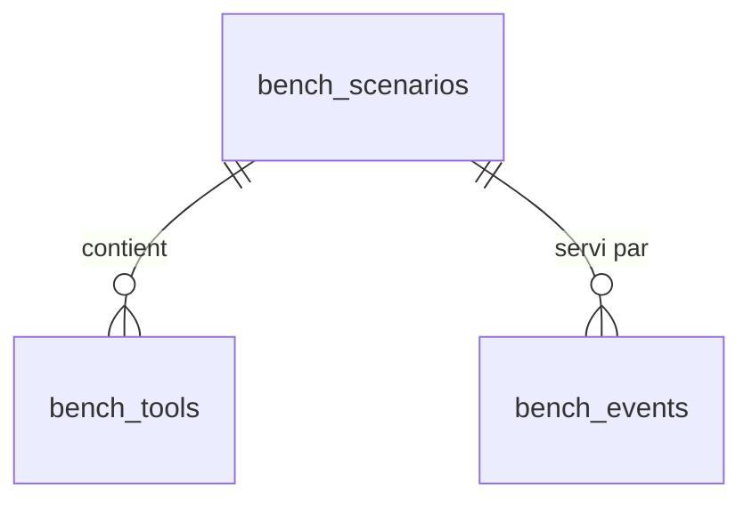

# Architecture — MCP Bench

**Dernière MAJ :** 2026-09-22

## 1. Vue d'ensemble

```mermaid
graph TB
    CC[Claude Code] --> R
    CD[Claude Desktop / Cowork] --> R
    CW[claude.ai] --> R
    GPT[ChatGPT] --> R
    INS[MCP Inspector] --> R
    R[/api/mcp  Streamable HTTP stateless/] --> SNAP[Snapshot par requête : scénario actif + tools]
    SNAP --> H[mcp-handler créé par requête]
    H --> TL[tools/list : lignes bench_tools transformées par le levier readme]
    H --> TC[tools/call : dispatch par handler echo / whoami / mutate / readme]
    R --> EV[Journal : after() → bench_events]
    SNAP --> DB[(Supabase Postgres)]
    TC --> DB
    EV --> DB
    SEED[scripts/bench-seed.mjs] --> DB
    STUDIO[Supabase Studio] --> DB
```

Aucune interface web propre au banc. Aucune IA serveur.

## 2. Stack technique

| Techno | Version | Rôle | Justification |
|--------|---------|------|---------------|
| Next.js | 15 (App Router) | Framework | Route handler `/api/[transport]` |
| TypeScript | ~5.8.3 (strict) | Typage | Épinglé 5.8.x (hangs tsc en 5.9) |
| Supabase | Cloud, projet `nwdmkehnxvqyxddgogtu` | Postgres | Tables du banc, Studio comme admin |
| @supabase/supabase-js | 2.x | Client serveur | Accès aux tables avec la clé secrète (ADR-002) |
| supabase (CLI, devDependency) | latest | Migrations | `db:push`, `db:types` |
| @modelcontextprotocol/sdk | épinglé sur le peer de mcp-handler (réf. 1.26.0) | Serveur MCP | Handlers bas niveau `tools/list`, `tools/call`, `sendToolListChanged` |
| mcp-handler | 1.x (réf. 1.1.0) | Endpoint MCP Next.js | Streamable HTTP, stateless (ADR-001) |
| Zod | 3.x | Validation | Schéma de `bench_mutate` uniquement |
| Vitest | 3.x | Tests | `InMemoryTransport` plus repository mémoire |
| pnpm | 12.x | Package manager | Fichier `packageManager` |

Non installés (hors scope MVP) : jose, @modelcontextprotocol/ext-apps, vite, @supabase/ssr, redis.

## 3. Structure du projet

```
src/
├── app/
│   ├── api/[transport]/route.ts      # Endpoint /api/mcp : snapshot → handler → journal
│   ├── (dashboard)/                  # Template (inchangé)
│   └── design-system/                # Template (inchangé)
├── mcp/
│   ├── config.ts                     # serverInfo par défaut (snapshot vide), secret ack (S03), plafonds
│   ├── server.ts                     # Assemblage : options depuis le snapshot, handlers bas niveau
│   └── bench/
│       ├── repository.ts             # Interface BenchRepository + SupabaseBenchRepository + MemoryBenchRepository
│       ├── snapshot.ts               # loadSnapshot(repo) : scénario actif + tools activés
│       ├── registry.ts               # dispatch tools/call par handler, gardes ack / gate
│       ├── levers.ts                 # rows → Tool[] (JSON Schema brut) + applyLever : fonctions pures, sans import runtime
│       ├── context.ts                # BenchRequestContext, outcomes par requestId (évite le cycle registry → handlers → levers)
│       ├── ack.ts                    # makeAck / verifyAck (HMAC SHA-256, fenêtre TTL)
│       ├── events.ts                 # parse JSON-RPC → BenchEventInsert[] ; logEvents(repo) ; outcomes
│       ├── repository.memory.ts      # implémentation mémoire (tests)
│       └── handlers/
│           ├── echo.ts
│           ├── whoami.ts
│           ├── mutate.ts
│           └── readme.ts
├── lib/
│   ├── schemas/bench-mutate.ts       # Zod : input de bench_mutate
│   └── supabase/admin.ts             # createClient(url, SUPABASE_SECRET_KEY) — serveur uniquement (ADR-002)
└── types/database.ts                 # généré par supabase gen types
scripts/
├── smoke-mcp.mjs                     # initialize + tools/list + bench_whoami + bench_echo + mutate contre une URL
├── bench-seed.mjs                    # pousse le catalogue en base (idempotent par slug), restaure baseline, jamais is_active
└── lib/
    ├── probes.mjs                    # SOURCE UNIQUE des 4 sondes et du scénario baseline (les migrations n'amorcent)
    └── catalogue.mjs                 # catalogue des scénarios + générateur de canaris (testé par vitest)
supabase/
├── config.toml
└── migrations/
docs/bench/
├── protocol.md
└── results.md
```

## 4. Modèle de données



### Tables

**bench_scenarios**

| Colonne | Type | Nullable | Default | Description |
|---------|------|----------|---------|-------------|
| id | uuid | non | gen_random_uuid() | |
| slug | text | non | | Unique. Ex. `baseline`, `desc_len_8k`, `readme_ack` |
| notes | text | oui | | Ce que le scénario mesure |
| server_name | text | non | 'mcp-bench' | `serverInfo.name` |
| server_title | text | oui | | `serverInfo.title` |
| server_version | text | non | '1.0.0' | `serverInfo.version`, incrémentée par `bench_mutate` |
| instructions | text | non | '' | Instructions serveur |
| readme_content | text | oui | | Renvoyé par `bench_readme` |
| readme_lever | text | non | 'none' | check in (none, instructions, descriptions, name_first, gate, ack, hub) |
| ack_ttl_seconds | int | oui | | Fenêtre de validité de l'ack et du gate ; nul = illimité |
| is_active | bool | non | false | Index unique partiel `where is_active` |
| created_at, updated_at | timestamptz | non | now() | |

**bench_tools**

| Colonne | Type | Nullable | Default | Description |
|---------|------|----------|---------|-------------|
| id | uuid | non | gen_random_uuid() | |
| scenario_id | uuid | non | | FK bench_scenarios on delete cascade |
| name | text | non | | Unique par scénario |
| title | text | oui | | |
| description | text | non | '' | |
| input_schema | jsonb | non | '{"type":"object","properties":{}}' | JSON Schema servi tel quel |
| annotations | jsonb | oui | | readOnlyHint, etc. |
| handler | text | non | 'echo' | check in (echo, whoami, mutate, readme) |
| enabled | bool | non | true | |
| version | int | non | 1 | Incrémentée à chaque update |
| sort_order | int | non | 0 | Ordre dans `tools/list` |
| created_at, updated_at | timestamptz | non | now() | |

**bench_events**

| Colonne | Type | Nullable | Default | Description |
|---------|------|----------|---------|-------------|
| id | bigint identity | non | | |
| ts | timestamptz | non | now() | |
| scenario_slug | text | oui | | Scénario servi (dénormalisé) |
| server_version | text | oui | | |
| method | text | non | | initialize, notifications/initialized, tools/list, tools/call, ping, autre |
| rpc_id | text | oui | | id JSON-RPC |
| client_name | text | oui | | `params.clientInfo.name` (initialize) |
| client_version | text | oui | | |
| protocol_version | text | oui | | params ou en-tête `Mcp-Protocol-Version` |
| user_agent | text | oui | | |
| ip | text | oui | | `x-forwarded-for` premier élément |
| session_id | text | oui | | En-tête `Mcp-Session-Id` (nul en stateless) |
| tool_name | text | oui | | tools/call |
| args | jsonb | oui | | tools/call, tronqué à 8 ko |
| tools_served | int | oui | | tools/list |
| response_chars | int | oui | | tools/list : longueur de `JSON.stringify(tools)` |
| list_changed_sent | bool | oui | | bench_mutate |
| is_error | bool | non | false | |
| error_text | text | oui | | |

Index : `bench_events (ts desc)`, `bench_events (user_agent, ip, ts)`, `bench_tools (scenario_id, sort_order)`.

### RLS Policies

| Table | Policy | Opération | Condition |
|-------|--------|-----------|-----------|
| bench_scenarios | RLS activé, aucune policy | toutes | Aucun accès anon/authenticated ; serveur via clé secrète (ADR-002) |
| bench_tools | RLS activé, aucune policy | toutes | idem |
| bench_events | RLS activé, aucune policy | toutes | idem |

## 5. Server Actions

N/A : aucune interface web. Les mutations passent par `bench_mutate` (tool, Zod) et `scripts/bench-seed.mjs`.

## 6. Canal MCP

### Cycle d'une requête

1. La route clone le body, le parse en JSON-RPC (objet ou batch).
2. `loadSnapshot(repo)` lit le scénario actif et ses tools activés (aucun cache).
3. `createMcpHandler` est appelé **par requête** avec `serverInfo` et `instructions` du snapshot et `capabilities.tools.listChanged = true`.
4. Le callback d'init pose deux handlers bas niveau sur `server.server` : `ListToolsRequestSchema` renvoie `applyLever(snapshot)` ; `CallToolRequestSchema` dispatche par `handler`. Aucun `registerTool` (il installerait ses propres handlers).
5. La réponse est renvoyée ; `after()` (next/server) journalise les événements. Échec du journal = `console.error`, jamais une erreur MCP. Les handlers de tools renseignent un `outcome` par `rpc_id` (`list_changed_sent`, `is_error`, `error_text`) que la route fusionne dans les événements `tools/call` avant écriture (S03).
6. GET et DELETE ne chargent pas de snapshot : journalisés comme `http:GET` / `http:DELETE` (le host tente d'ouvrir le flux SSE) puis 405 (S03).

### Tools

| Tool | Input | Effet | Widget | Parcours |
|------|-------|-------|--------|----------|
| bench_whoami | `{note?, ack?}` | Lecture : scénario, version, en-têtes, tools servis, hashes ; `note` = tag host/modèle du testeur, renvoyé et journalisé | N/A | 4.2 |
| bench_echo | `{message?, ack?, ...}` | Lecture : renvoie les arguments | N/A | 4.2 |
| bench_mutate | Zod `bench-mutate.ts` | Écriture : tools et instructions du scénario actif, bump version, tentative `list_changed` | N/A | 4.1 |
| bench_readme | `{}` | Lecture : `readme_content` + ack | N/A | 4.3 |
| tools générés | libre | Lecture : echo | N/A | 4.2 |

Les sondes sont des lignes `bench_tools` avec `handler` non-echo : leurs nom, titre et description sont donc eux aussi des variables de test.

### Leviers readme (`levers.ts`, fonction pure)

| Levier | Effet sur `tools/list` et instructions |
|--------|----------------------------------------|
| none | Aucun |
| instructions | Instructions préfixées : « ALWAYS call bench_readme before any other tool of this server, once per conversation. » |
| descriptions | Descriptions non-readme préfixées : « Requires bench_readme first (call it once per conversation before this tool). » |
| name_first | Readme renommé `bench_00_readme`, `sort_order` forcé en tête |
| gate | Liste inchangée ; `tools/call` non-readme rejeté sans événement readme récent de la même empreinte (user_agent, ip) dans `ack_ttl_seconds` (défaut 1800). L'empreinte est fournie par l'appelant : le gate est un instrument de mesure, pas un contrôle d'accès (ADR-002) |
| ack | Propriété requise `ack` ajoutée à chaque tool non-readme ; `tools/call` vérifie `verifyAck` |
| hub | Descriptions non-readme remplacées par « <name>: see bench_readme for usage. » |

### Ack

`ack = base32(HMAC_SHA256(BENCH_ACK_SECRET, scenario_id + sha256(readme_content) + window))[0..12]` avec `window = floor(now / ack_ttl_seconds)` ou `0` si TTL nul. Vérification : fenêtre courante ou précédente. Aucun état serveur.

### Widgets

N/A.

### Auth MCP

Phase 1 : aucune (ADR-002). Phase 3 (E03) : Supabase OAuth 2.1 Server, `/.well-known/oauth-protected-resource`, page `/oauth/consent`.

## 7. Auth & Sécurité

- Endpoint public. Aucune donnée personnelle stockée hors user-agent et IP du host (données techniques, purgeables).
- Aucun middleware : toute route `/api/*` est publique par construction ; chaque handler ajouté porte sa propre auth (mcp-patterns §6 bis).
- Clé secrète Supabase uniquement dans `src/lib/supabase/admin.ts`, jamais importée par un composant client, jamais préfixée `NEXT_PUBLIC_`.
- `BENCH_ACK_SECRET` requis en production : absent = erreur explicite au premier usage.
- `bench_mutate` : validation Zod, noms de tools limités à `^[a-zA-Z0-9_.-]{1,255}$`, descriptions plafonnées à 100 ko, schéma JSON plafonné à 64 ko.
- Arguments d'un tool echo plafonnés à 64 ko ; `args` journalisés tronqués à 8 ko.
- Pas de rate limiting (banc personnel, URL non publiée) : accepté par ADR-002.

## 8. Infrastructure & Déploiement

- **Hébergement :** Vercel, projet `mcp-test` (https://mcp-test-navy.vercel.app), auto-deploy sur push de `main`.
- **Supabase :** Cloud, projet `nwdmkehnxvqyxddgogtu`, région par défaut.
- **CI/CD :** GitHub Actions `pnpm build` uniquement (existant). Migrations poussées en local (`pnpm db:push`), pas de workflow migrations (écarté : rien ne casse sans lui aujourd'hui).
- **Environnements :** local (`.env.local`) et production. Pas de staging.
- **Variables Vercel (production) :** `NEXT_PUBLIC_SUPABASE_URL`, `SUPABASE_SECRET_KEY`, `BENCH_ACK_SECRET` (S03). `NEXT_PUBLIC_SITE_URL` et `MCP_RESOURCE_URL` ne sont lues par aucun code en phase 1 : elles reviennent avec E03 (RFC 9728).

## Invariants

Ces choix ne changent JAMAIS sans ADR documenté :
- Next.js 15 App Router
- TypeScript strict mode
- Supabase pour la DB, RLS activé sur toute table
- Zod pour toute validation d'entrée mutante
- Migrations SQL versionnées
- Transport stateless (ADR-001)
- Tools = données en base, le code ne contient que les handlers (ADR-002)
- Aucun cache serveur du snapshot

## Flexible

- Catalogue de scénarios (données)
- Format des canaris
- Plafonds de taille
- Déploiement

## Points d'attention

1. **mcp-handler par requête** : à vérifier en S02 que `createMcpHandler` accepte d'être instancié à chaque requête sans fuite ; sinon, utiliser directement `WebStandardStreamableHTTPServerTransport` du SDK.
2. **Batch JSON-RPC** : le journal doit gérer un body tableau.
3. **`after()`** : disponible en Next 15 ; si indisponible sur la route, `await` du journal avant la réponse (mesurer l'impact).
4. **Stateless** : pas de `Mcp-Session-Id`, pas de `clientInfo` hors `initialize` ; l'empreinte (user_agent, ip) est le seul lien entre requêtes.
5. **Taille de `tools/list`** avec 500 tools de 8 ko de description = 4 Mo : rester sous la limite de réponse Vercel (mesurer, plafonner le catalogue si besoin).
