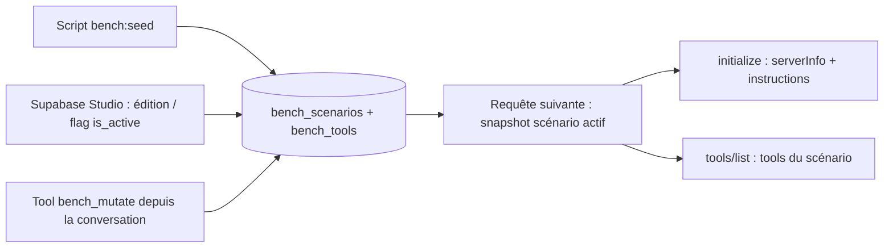
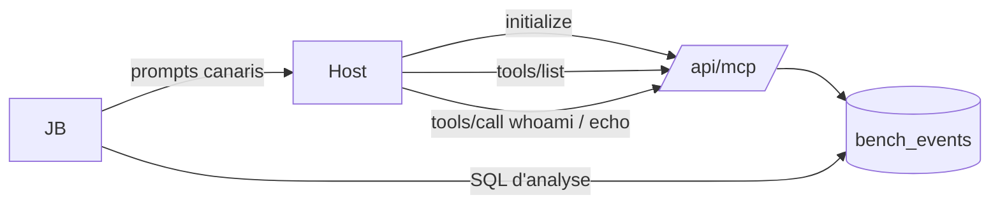
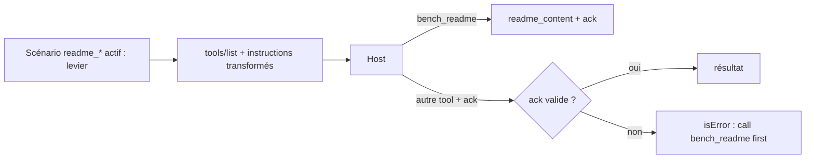
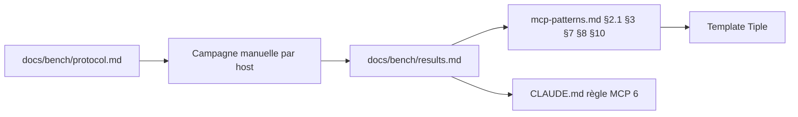
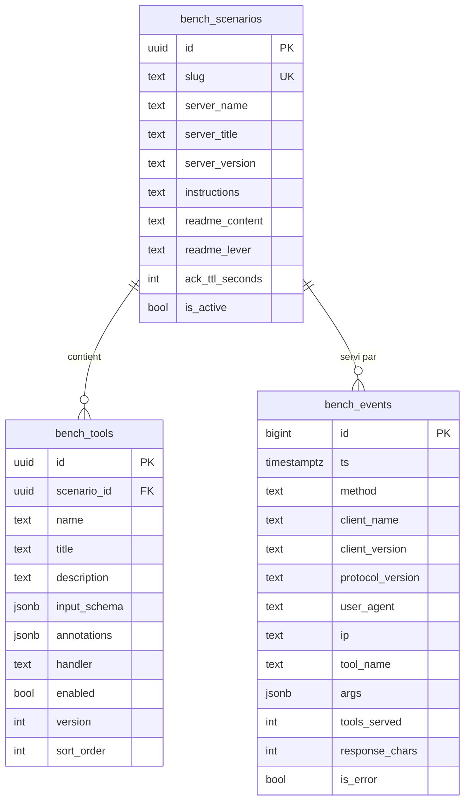

# PRD — MCP Bench

**Statut global :** 🔶 Draft
**Dernière MAJ :** 2026-09-22

## 1. Vision

### Résumé exécutif
Les conventions MCP de Tiple Method affirment des comportements de hosts (cache des métadonnées, troncature, nombre de tools) sans mesure. MCP Bench est un serveur MCP dont tools, instructions et identité sont des lignes Supabase, qui journalise chaque requête par client et embarque des sondes et des canaris. Il produit, host par host, l'action minimale pour voir une mise à jour, les seuils de troncature, et le levier qui force la lecture d'un readme. Les résultats remplacent les affirmations de mcp-patterns.md.

### Vision
Le banc reste en place et se rejoue à chaque évolution notable d'un host ; les conventions Tiple portent des faits datés, pas des souvenirs.

## 2. Personas

| Persona | Rôle | Objectif principal | Parcours clés |
|---------|------|-------------------|---------------|
| JB | Auteur Tiple Method, testeur | Mesurer et restituer | 4.1, 4.2, 4.4 |
| Agent hôte | Modèle du host connecté au serveur | Découvrir tools et readme | 4.2, 4.3 |

## 3. Design System (résumé)

Aucune interface web dans le MVP. Design system Tiple par défaut conservé pour la page `/design-system` existante.

| Token | Valeur | Usage |
|-------|--------|-------|
| --primary | #06f5a2 | Couleur principale (fills, bordures) |
| --font-sans | Instrument Sans | Corps de texte |
| --space-4 | 16px | Espacement standard |

**Design system complet :** voir `docs/design/system.md`

## 4. Parcours utilisateur

### 4.1 Piloter un scénario

**Persona :** JB
**Objectif :** Mettre le serveur dans un état de test précis (tools, instructions, identité, levier readme) sans redéployer.

#### Flow

#### Écrans

| Écran | Référence UI | Description |
|-------|-------------|-------------|
| Éditeur de tables | N/A (Supabase Studio) | Édition des lignes, bascule du scénario actif |

#### Exigences fonctionnelles

| ID | Description | Priorité | Référence UI | Statut |
|----|------------|----------|----------|--------|
| FR-PILOT-01 | `initialize` et `tools/list` reflètent le scénario actif (serverInfo, instructions, tools activés, versions) dès la requête suivante, sans redéploiement | Must | N/A | 🔶 |
| FR-PILOT-02 | Le script de seed crée ou met à jour (idempotent, par slug) le catalogue de scénarios avec canaris | Must | N/A | 🔶 |
| FR-PILOT-03 | `bench_mutate` crée, modifie, active ou désactive un tool, ou remplace les instructions du scénario actif, et incrémente `server_version` | Must | N/A | 🔶 |
| FR-PILOT-04 | Un seul scénario actif à la fois, garanti par contrainte en base | Should | N/A | 🔶 |
| FR-PILOT-05 | `bench_mutate` tente d'émettre `notifications/tools/list_changed` et journalise si l'émission a eu lieu | Could | N/A | 🔶 |

**Critères d'acceptation FR-PILOT-01 :**
- [ ] Given un scénario actif avec 3 tools activés et 1 désactivé When un client appelle `tools/list` Then la réponse contient exactement les 3 tools activés, avec name, title, description, inputSchema et annotations des lignes
- [ ] Given une description modifiée en base When le client appelle `tools/list` Then la nouvelle description est servie sans redéploiement
- [ ] Given un scénario actif When un client appelle `initialize` Then `serverInfo` et `instructions` proviennent de la ligne du scénario

**Critères d'acceptation FR-PILOT-02 :**
- [ ] Given une base vide When `pnpm bench:seed` s'exécute deux fois Then chaque scénario du catalogue existe une seule fois et ses tools sont identiques aux deux passes
- [ ] Given un scénario généré When on lit une description, un titre ou les instructions Then trois canaris distincts (start, middle, end) y figurent au format `[C:<scenario>:<champ>:<pos>:<4hex>]`

**Critères d'acceptation FR-PILOT-03 :**
- [ ] Given le scénario actif When l'agent appelle `bench_mutate` avec `action: create_tool` Then une ligne `bench_tools` activée est créée, `server_version` est incrémentée, et le résultat texte invite à appeler `bench_whoami`
- [ ] Given un tool existant When `action: update_tool` avec une description Then la ligne est mise à jour et `version` de la ligne incrémentée
- [ ] Given un tool existant When `action: disable_tool` Then il disparaît du `tools/list` suivant
- [ ] Given des arguments invalides (Zod) When `bench_mutate` est appelé Then résultat `isError` avec le champ fautif et la correction attendue

**Critères d'acceptation FR-PILOT-04 :**
- [ ] Given un scénario actif When on active un second scénario en base Then l'insertion échoue (index unique partiel) tant que le premier n'est pas désactivé

**Critères d'acceptation FR-PILOT-05 :**
- [ ] Given le transport stateless When `bench_mutate` s'exécute Then l'événement journalisé porte `list_changed_sent = false` sans erreur retournée à l'agent

#### Exigences non-fonctionnelles

| ID | Catégorie | Description | Cible | Référence UI | Statut |
|----|-----------|------------|-------|----------|--------|
| NFR-PILOT-01 | Fiabilité | Le snapshot est relu à chaque requête, aucun cache serveur | 0 cache | N/A | 🔶 |

---

### 4.2 Observer ce que le host lit

**Persona :** JB, agent hôte
**Objectif :** Savoir quand chaque host lit instructions et tools, ce qu'il en retient, et à quelle taille il tronque.

#### Flow

#### Écrans

| Écran | Référence UI | Description |
|-------|-------------|-------------|
| Journal | N/A (Supabase Studio, SQL) | Lecture des événements, requêtes d'analyse du protocole |

#### Exigences fonctionnelles

| ID | Description | Priorité | Référence UI | Statut |
|----|------------|----------|----------|--------|
| FR-OBS-01 | Chaque requête JSON-RPC reçue est journalisée : méthode, id, clientInfo (initialize), version de protocole, user-agent, IP, session id, tool et arguments (tools/call), scénario et version serveur servis | Must | N/A | 🔶 |
| FR-OBS-02 | `bench_whoami` renvoie en texte : scénario actif, version serveur, en-têtes vus (user-agent, protocole, session), liste des tools servis avec leur version, hash des instructions et du readme | Must | N/A | 🔶 |
| FR-OBS-03 | `bench_echo` renvoie ses arguments tels que reçus (test des changements de schéma) | Must | N/A | 🔶 |
| FR-OBS-04 | `tools/list` journalise le nombre de tools servis et la taille en caractères de la liste sérialisée | Should | N/A | 🔶 |
| FR-OBS-05 | Les tools générés (handler echo) acceptent n'importe quel argument et le renvoient, sans validation autre qu'un plafond de taille | Should | N/A | 🔶 |

**Critères d'acceptation FR-OBS-01 :**
- [ ] Given une requête `initialize` avec `clientInfo {name, version}` When elle est traitée Then une ligne `bench_events` porte method, client_name, client_version, protocol_version, user_agent, ip, scenario_slug, server_version
- [ ] Given une requête `tools/call` When elle est traitée Then la ligne porte tool_name et args (jsonb)
- [ ] Given un batch JSON-RPC de N requêtes When il est traité Then N lignes sont journalisées
- [ ] Given une insertion en base qui échoue When la requête MCP est traitée Then la réponse MCP est renvoyée normalement et l'erreur est écrite sur la console serveur

**Critères d'acceptation FR-OBS-02 :**
- [ ] Given un scénario actif When `bench_whoami` est appelé Then le `content` texte contient le slug, la version serveur, la liste `name@version` de chaque tool activé et le user-agent de la requête
- [ ] Given le résultat When on le lit Then `structuredContent` contient les mêmes données en JSON

**Critères d'acceptation FR-OBS-03 :**
- [ ] Given des arguments `{message: "x", extra: 1}` When `bench_echo` est appelé Then le résultat texte contient la sérialisation exacte des arguments reçus

**Critères d'acceptation FR-OBS-04 :**
- [ ] Given 500 tools activés When `tools/list` est servi Then l'événement porte tools_served = 500 et response_chars = longueur de `JSON.stringify(tools)`

**Critères d'acceptation FR-OBS-05 :**
- [ ] Given un tool généré When il est appelé avec 10 ko d'arguments Then il les renvoie ; avec plus de 64 ko Then résultat `isError` actionnable

#### Exigences non-fonctionnelles

| ID | Catégorie | Description | Cible | Référence UI | Statut |
|----|-----------|------------|-------|----------|--------|
| NFR-OBS-01 | Performance | `tools/list` avec 500 tools | < 2 s p95 sur Vercel | N/A | 🔶 |
| NFR-OBS-02 | Fiabilité | La journalisation ne retarde ni ne casse la réponse MCP | 0 réponse MCP en erreur due au journal | N/A | 🔶 |

---

### 4.3 Faire lire le readme

**Persona :** agent hôte
**Objectif :** Vérifier quel levier amène l'agent à appeler `bench_readme` au premier usage du serveur dans une conversation, et à quel coût.

#### Flow

#### Écrans

| Écran | Référence UI | Description |
|-------|-------------|-------------|
| Aucun | N/A | Interaction dans le host |

#### Exigences fonctionnelles

| ID | Description | Priorité | Référence UI | Statut |
|----|------------|----------|----------|--------|
| FR-README-01 | `bench_readme` renvoie le `readme_content` du scénario actif (avec canaris) et un code `ack` dérivé par HMAC du scénario, du contenu et de la fenêtre TTL | Must | N/A | 🔶 |
| FR-README-02 | Levier `ack` : tout tool autre que le readme expose une propriété requise `ack` et rejette un ack absent, invalide ou expiré par une erreur actionnable | Must | N/A | 🔶 |
| FR-README-03 | Levier `gate` : tout tool autre que le readme est rejeté si aucun appel `bench_readme` de la même empreinte (user-agent, IP) n'existe dans la fenêtre TTL | Should | N/A | 🔶 |
| FR-README-04 | Leviers `instructions`, `descriptions`, `name_first`, `hub` : transformation pure de la liste des tools et des instructions selon le scénario | Should | N/A | 🔶 |
| FR-README-05 | TTL de l'ack configurable par scénario ; nul = valable pour toute la conversation | Could | N/A | 🔶 |

**Critères d'acceptation FR-README-01 :**
- [ ] Given un scénario avec `readme_content` When `bench_readme` est appelé Then le texte contient le contenu et une ligne `ack: <code>`
- [ ] Given deux appels dans la même fenêtre When on compare les ack Then ils sont identiques ; Given un `readme_content` modifié Then l'ack change

**Critères d'acceptation FR-README-02 :**
- [ ] Given levier `ack` When `tools/list` est servi Then chaque tool non-readme a `ack` dans `inputSchema.required` avec une description qui renvoie à `bench_readme`
- [ ] Given un ack valide When `bench_echo` est appelé Then résultat normal ; Given un ack absent ou faux Then `isError` avec « Call bench_readme first and pass its ack »
- [ ] Given TTL 60 s et un ack vieux de 120 s When un tool est appelé Then rejet avec mention d'expiration

**Critères d'acceptation FR-README-03 :**
- [ ] Given levier `gate` et aucun événement readme pour l'empreinte When `bench_echo` est appelé Then rejet ; Given un événement readme récent Then résultat normal

**Critères d'acceptation FR-README-04 :**
- [ ] Given levier `instructions` Then les instructions commencent par la consigne d'appel du readme ; Given `descriptions` Then chaque description non-readme commence par « Requires bench_readme first » ; Given `name_first` Then le readme s'appelle `bench_00_readme` et est premier ; Given `hub` Then chaque description non-readme est réduite à une ligne renvoyant au readme
- [ ] Given levier `none` Then liste et instructions sont servies telles quelles

#### Exigences non-fonctionnelles

| ID | Catégorie | Description | Cible | Référence UI | Statut |
|----|-----------|------------|-------|----------|--------|
| NFR-README-01 | Sécurité | Le secret HMAC vient de l'environnement ; absent en prod = démarrage en erreur explicite | 0 fallback silencieux | N/A | 🔶 |

---

### 4.4 Restituer

**Persona :** JB
**Objectif :** Transformer les mesures en règles datées dans les conventions.

#### Flow

#### Écrans

| Écran | Référence UI | Description |
|-------|-------------|-------------|
| Aucun | N/A | Documents markdown |

#### Exigences fonctionnelles

| ID | Description | Priorité | Référence UI | Statut |
|----|------------|----------|----------|--------|
| FR-REST-01 | `docs/bench/protocol.md` : échelle d'actions par host, prompts canaris, requêtes SQL d'analyse | Must | N/A | 🔶 |
| FR-REST-02 | `docs/bench/results.md` : grille host × mutation (action minimale), seuils mesurés, levier readme retenu, chacun daté avec clientInfo | Must | N/A | 🔶 |
| FR-REST-03 | mcp-patterns.md §2.1, §3, §7, §8, §10 et CLAUDE.md règle MCP 6 mis à jour : chaque affirmation porte un statut (confirmé, infirmé, précisé), une date et le scénario source ; report dans le template Tiple | Must | N/A | 🔶 |
| FR-REST-04 | `docs/mcp-golden-queries.md` créé depuis le template avec les prompts des sondes | Should | N/A | 🔶 |

**Critères d'acceptation FR-REST-01 :**
- [ ] Given le protocole When JB le suit sur un host Then chaque étape a un prompt exact, une observation attendue et l'endroit où la lire (host ou SQL)

**Critères d'acceptation FR-REST-02 :**
- [ ] Given une case de la grille When elle est remplie Then elle porte l'action minimale, la date et le `client_name@client_version` loggé

**Critères d'acceptation FR-REST-03 :**
- [ ] Given §8 When la story est close Then la phrase « les hosts cachent instructions et descriptions » est remplacée par la grille mesurée, et aucune affirmation des sections listées n'est sans statut

**Critères d'acceptation FR-REST-04 :**
- [ ] Given le fichier When on le lit Then il contient au moins 3 prompts directs, 3 indirects et 2 négatifs visant les sondes

#### Exigences non-fonctionnelles

| ID | Catégorie | Description | Cible | Référence UI | Statut |
|----|-----------|------------|-------|----------|--------|
| NFR-REST-01 | Traçabilité | Chaque fait mesuré cite le scénario et la requête SQL qui le produit | 100 % | N/A | 🔶 |

## 5. Modèle de données (résumé)

| Entité | Parcours concernés | Description |
|--------|-------------------|-------------|
| bench_scenarios | 4.1, 4.3 | Variables de niveau serveur et levier readme ; un seul actif |
| bench_tools | 4.1, 4.2, 4.3 | Variables de niveau tool ; les sondes sont des lignes avec un `handler` |
| bench_events | 4.2, 4.3, 4.4 | Mesure : une ligne par requête JSON-RPC |

## 6. Epics

| ID | Titre | Parcours | Priorité | Dépendances | Statut |
|----|-------|----------|----------|-------------|--------|
| E01 | Banc MCP stateless | 4.1, 4.2, 4.3, 4.4 | P0 | — | 🟢 |
| E02 | Push listChanged (transport stateful) | 4.1 | P1 | E01 | ⬜ |
| E03 | OAuth Supabase comme variable de test | 4.2 | P2 | E01 | ⬜ |

## 7. Hors scope

- Interface d'administration web.
- Widgets MCP Apps.
- Automatisation des hosts (Playwright sur claude.ai ou ChatGPT).
- Serveur privé, multi-utilisateur, RLS par utilisateur.
- Appel LLM côté serveur.

## 8. Hypothèses & Risques

### Hypothèses
- Claude Code lit instructions et tools à l'ouverture de session et au reconnect, injecte les instructions dans le system prompt, et diffère les schémas derrière ToolSearch au-delà d'un seuil de tools.
- claude.ai et ChatGPT cachent les métadonnées au niveau du connecteur.
- Les résultats de tools ne sont jamais cachés par les hosts : un readme avec ack peut porter les mises à jour.
- L'empreinte user-agent plus IP suffit à regrouper les requêtes d'une conversation en stateless.
- mcp-handler permet de créer un handler par requête à partir d'un snapshot.

### Risques
| Risque | Impact | Mitigation |
|--------|--------|------------|
| Hypothèse mcp-handler fausse | Réécriture de la route sur le SDK nu | Vérifié en S02 avant le reste |
| Vercel coupe les flux longs | E02 impossible sur Vercel | Serveur local plus tunnel pour E02 |
| Hosts trop différents pour une grille unique | Grille peu lisible | Une colonne par host, cellules datées |

## 9. Métriques de succès

| Métrique | Parcours | Baseline | Cible | Échéance |
|----------|----------|----------|-------|----------|
| Cases de la grille de propagation remplies | 4.4 | 0 | 24 (4 hosts × 6 mutations) | Fin E01 |
| Seuils de troncature mesurés | 4.2 | 0 | 4 champs × 4 hosts | Fin E01 |
| Levier readme validé par host | 4.3 | aucun | 1 par host ou impossibilité documentée | Fin E01 |
| Affirmations de mcp-patterns sans statut | 4.4 | toutes | 0 dans §2.1, §3, §7, §8, §10 | Fin E01-S05 |
