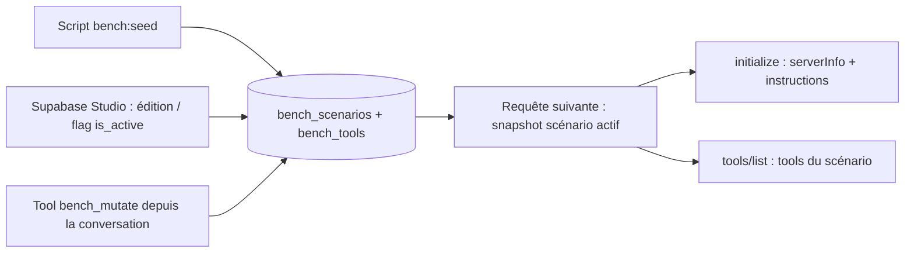
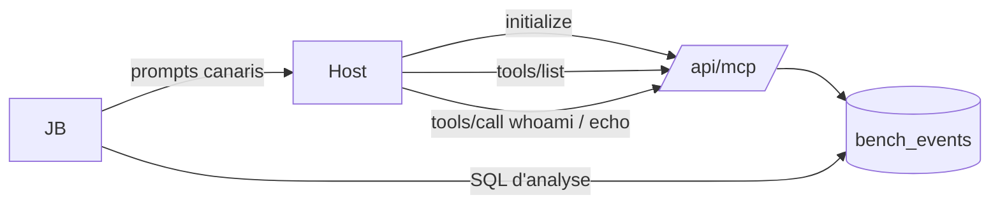
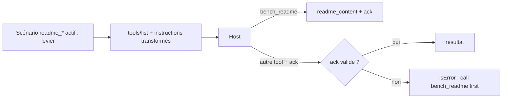
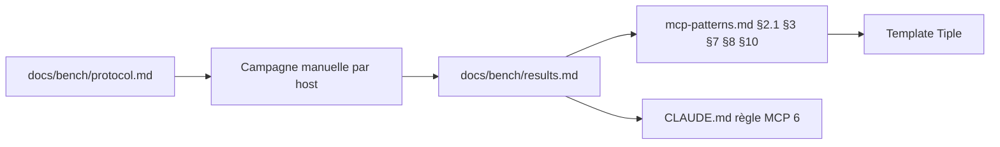
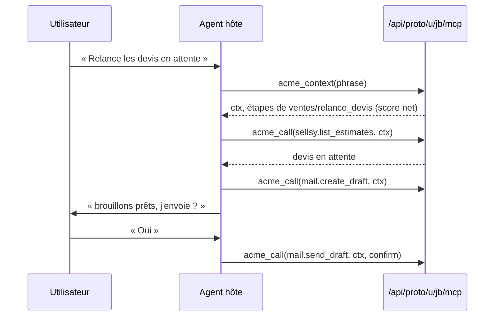
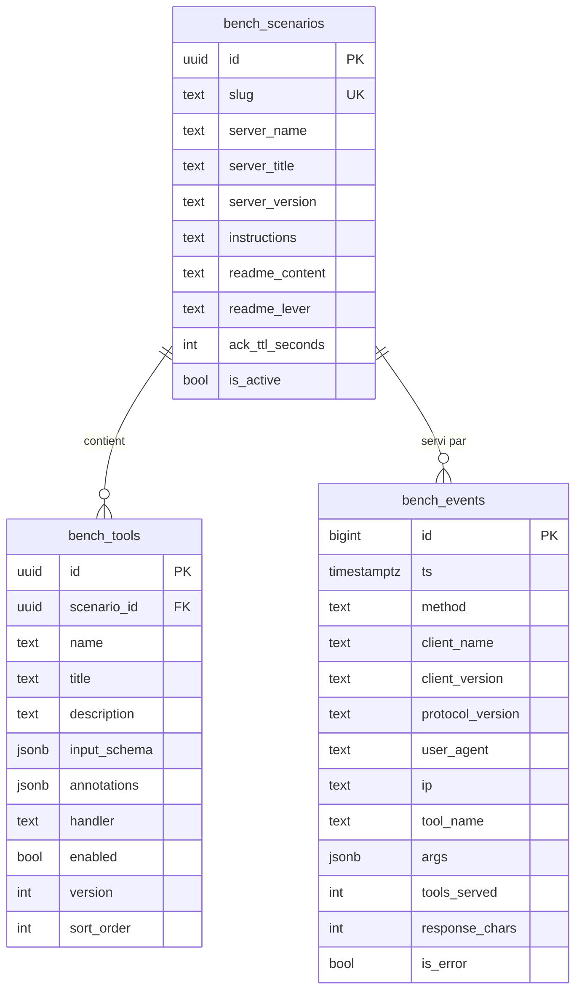

# PRD — MCP Bench

**Statut global :** 🔶 Draft
**Dernière MAJ :** 2026-09-23

## 1. Vision

### Résumé exécutif
Les conventions MCP de Tiple Method affirment des comportements de hosts (cache des métadonnées, troncature, nombre de tools) sans mesure. MCP Bench est un serveur MCP dont tools, instructions et identité sont des lignes Supabase, qui journalise chaque requête par client et embarque des sondes et des canaris. Il produit, host par host, l'action minimale pour voir une mise à jour, les seuils de troncature, et le levier qui force la lecture d'un readme. Les résultats remplacent les affirmations de mcp-patterns.md.

### Vision
Le banc reste en place et se rejoue à chaque évolution notable d'un host ; les conventions Tiple portent des faits datés, pas des souvenirs.

## 2. Personas

| Persona | Rôle | Objectif principal | Parcours clés |
|---------|------|-------------------|---------------|
| JB | Auteur Tiple Method, testeur | Mesurer et restituer | 4.1, 4.2, 4.4, 4.6 |
| Agent hôte | Modèle du host connecté au serveur | Découvrir tools et readme | 4.2, 4.3 |
| Second utilisateur | Alias de JB, membre d'Acme seulement | Prouver le refus d'un non-membre | 4.6 |

## 3. Design System (résumé)

Aucune interface web dans le MVP. Design system Tiple par défaut conservé pour la page `/design-system` existante.

| Token | Valeur | Usage |
|-------|--------|-------|
| --primary | #06f5a2 | Couleur principale (fills, bordures) |
| --font-sans | Instrument Sans | Corps de texte |
| --space-4 | 16px | Espacement standard |

**Design system complet :** voir `docs/design/system.md`

## 4. Parcours utilisateur

### 4.1 Piloter un scénario

**Persona :** JB
**Objectif :** Mettre le serveur dans un état de test précis (tools, instructions, identité, levier readme) sans redéployer.

#### Flow



#### Écrans

| Écran | Référence UI | Description |
|-------|-------------|-------------|
| Éditeur de tables | N/A (Supabase Studio) | Édition des lignes, bascule du scénario actif |

#### Exigences fonctionnelles

| ID | Description | Priorité | Référence UI | Statut |
|----|------------|----------|----------|--------|
| FR-PILOT-01 | `initialize` et `tools/list` reflètent le scénario actif (serverInfo, instructions, tools activés, versions) dès la requête suivante, sans redéploiement | Must | N/A | 🔶 |
| FR-PILOT-02 | Le script de seed crée ou met à jour (idempotent, par slug) le catalogue de scénarios avec canaris | Must | N/A | 🔶 |
| FR-PILOT-03 | `bench_mutate` crée, modifie, active ou désactive un tool, ou remplace les instructions du scénario actif, et incrémente `server_version` | Must | N/A | 🔶 |
| FR-PILOT-04 | Un seul scénario actif à la fois, garanti par contrainte en base | Should | N/A | 🔶 |
| FR-PILOT-05 | `bench_mutate` émet `notifications/tools/list_changed` dans le flux de réponse de sa propre requête (`relatedRequestId`, seule voie stateless) et journalise `list_changed_sent` = écriture réussie dans ce flux | Could | N/A | 🔶 |

**Critères d'acceptation FR-PILOT-01 :**
- [ ] Given un scénario actif avec 3 tools activés et 1 désactivé When un client appelle `tools/list` Then la réponse contient exactement les 3 tools activés, avec name, title, description, inputSchema et annotations des lignes
- [ ] Given une description modifiée en base When le client appelle `tools/list` Then la nouvelle description est servie sans redéploiement
- [ ] Given un scénario actif When un client appelle `initialize` Then `serverInfo` et `instructions` proviennent de la ligne du scénario

**Critères d'acceptation FR-PILOT-02 :**
- [ ] Given une base vide When `pnpm bench:seed` s'exécute deux fois Then chaque scénario du catalogue existe une seule fois et ses tools sont identiques aux deux passes
- [ ] Given un scénario généré When on lit une description, un titre ou les instructions Then trois canaris distincts (start, middle, end) y figurent au format `[C:<scenario>:<champ>:<pos>:<4hex>]`

**Critères d'acceptation FR-PILOT-03 :**
- [ ] Given le scénario actif When l'agent appelle `bench_mutate` avec `action: create_tool` Then une ligne `bench_tools` activée est créée, `server_version` est incrémentée, et le résultat texte invite à appeler `bench_whoami`
- [ ] Given un tool existant When `action: update_tool` avec une description Then la ligne est mise à jour et `version` de la ligne incrémentée
- [ ] Given un tool existant When `action: disable_tool` Then il disparaît du `tools/list` suivant
- [ ] Given des arguments invalides (Zod) When `bench_mutate` est appelé Then résultat `isError` avec le champ fautif et la correction attendue

**Critères d'acceptation FR-PILOT-04 :**
- [ ] Given un scénario actif When on active un second scénario en base Then l'insertion échoue (index unique partiel) tant que le premier n'est pas désactivé

**Critères d'acceptation FR-PILOT-05 :**
- [ ] Given le transport stateless When `bench_mutate` s'exécute Then la notification `notifications/tools/list_changed` précède le résultat dans le flux de réponse du même appel et l'événement porte `list_changed_sent = true` ; Given un transport sans flux Then `list_changed_sent = false` sans erreur retournée à l'agent

#### Exigences non-fonctionnelles

| ID | Catégorie | Description | Cible | Référence UI | Statut |
|----|-----------|------------|-------|----------|--------|
| NFR-PILOT-01 | Fiabilité | Le snapshot est relu à chaque requête, aucun cache serveur | 0 cache | N/A | 🔶 |

---

### 4.2 Observer ce que le host lit

**Persona :** JB, agent hôte
**Objectif :** Savoir quand chaque host lit instructions et tools, ce qu'il en retient, et à quelle taille il tronque.

#### Flow



#### Écrans

| Écran | Référence UI | Description |
|-------|-------------|-------------|
| Journal | N/A (Supabase Studio, SQL) | Lecture des événements, requêtes d'analyse du protocole |

#### Exigences fonctionnelles

| ID | Description | Priorité | Référence UI | Statut |
|----|------------|----------|----------|--------|
| FR-OBS-01 | Chaque requête JSON-RPC reçue est journalisée : méthode, id, clientInfo (initialize), version de protocole, user-agent, IP, session id, tool et arguments (tools/call), scénario et version serveur servis | Must | N/A | 🔶 |
| FR-OBS-02 | `bench_whoami` renvoie en texte : scénario actif, version serveur, en-têtes vus (user-agent, protocole, session), liste des tools servis avec leur version, hash des instructions et du readme ; accepte un `note` optionnel (tag host/modèle) renvoyé tel quel et journalisé avec l'appel, car le serveur ne voit jamais le modèle du host | Must | N/A | 🔶 |
| FR-OBS-03 | `bench_echo` renvoie ses arguments tels que reçus (test des changements de schéma) | Must | N/A | 🔶 |
| FR-OBS-04 | `tools/list` journalise le nombre de tools servis et la taille en caractères de la liste sérialisée | Should | N/A | 🔶 |
| FR-OBS-05 | Les tools générés (handler echo) acceptent n'importe quel argument et le renvoient, sans validation autre qu'un plafond de taille | Should | N/A | 🔶 |

**Critères d'acceptation FR-OBS-01 :**
- [ ] Given une requête `initialize` avec `clientInfo {name, version}` When elle est traitée Then une ligne `bench_events` porte method, client_name, client_version, protocol_version, user_agent, ip, scenario_slug, server_version
- [ ] Given une requête `tools/call` When elle est traitée Then la ligne porte tool_name et args (jsonb)
- [ ] Given un batch JSON-RPC de N requêtes When il est traité Then N lignes sont journalisées
- [ ] Given une insertion en base qui échoue When la requête MCP est traitée Then la réponse MCP est renvoyée normalement et l'erreur est écrite sur la console serveur

**Critères d'acceptation FR-OBS-02 :**
- [ ] Given un scénario actif When `bench_whoami` est appelé Then le `content` texte contient le slug, la version serveur, la liste `name@version` de chaque tool activé et le user-agent de la requête
- [ ] Given le résultat When on le lit Then `structuredContent` contient les mêmes données en JSON

**Critères d'acceptation FR-OBS-03 :**
- [ ] Given des arguments `{message: "x", extra: 1}` When `bench_echo` est appelé Then le résultat texte contient la sérialisation exacte des arguments reçus

**Critères d'acceptation FR-OBS-04 :**
- [ ] Given 500 tools activés When `tools/list` est servi Then l'événement porte tools_served = 500 et response_chars = longueur de `JSON.stringify(tools)`

**Critères d'acceptation FR-OBS-05 :**
- [ ] Given un tool généré When il est appelé avec 10 ko d'arguments Then il les renvoie ; avec plus de 64 ko Then résultat `isError` actionnable

#### Exigences non-fonctionnelles

| ID | Catégorie | Description | Cible | Référence UI | Statut |
|----|-----------|------------|-------|----------|--------|
| NFR-OBS-01 | Performance | `tools/list` avec 500 tools | < 2 s p95 sur Vercel | N/A | 🔶 |
| NFR-OBS-02 | Fiabilité | La journalisation ne retarde ni ne casse la réponse MCP | 0 réponse MCP en erreur due au journal | N/A | 🔶 |

---

### 4.3 Faire lire le readme

**Persona :** agent hôte
**Objectif :** Vérifier quel levier amène l'agent à appeler `bench_readme` au premier usage du serveur dans une conversation, et à quel coût.

#### Flow



#### Écrans

| Écran | Référence UI | Description |
|-------|-------------|-------------|
| Aucun | N/A | Interaction dans le host |

#### Exigences fonctionnelles

| ID | Description | Priorité | Référence UI | Statut |
|----|------------|----------|----------|--------|
| FR-README-01 | `bench_readme` renvoie le `readme_content` du scénario actif (avec canaris) et un code `ack` dérivé par HMAC du scénario, du contenu et de la fenêtre TTL | Must | N/A | 🔶 |
| FR-README-02 | Levier `ack` : tout tool autre que le readme expose une propriété requise `ack` et rejette un ack absent, invalide ou expiré par une erreur actionnable | Must | N/A | 🔶 |
| FR-README-03 | Levier `gate` : tout tool autre que le readme est rejeté si aucun appel `bench_readme` de la même empreinte (user-agent, IP) n'existe dans la fenêtre TTL | Should | N/A | 🔶 |
| FR-README-04 | Leviers `instructions`, `descriptions`, `name_first`, `hub` : transformation pure de la liste des tools et des instructions selon le scénario | Should | N/A | 🔶 |
| FR-README-05 | TTL de l'ack configurable par scénario ; nul = valable pour toute la conversation | Could | N/A | 🔶 |

**Critères d'acceptation FR-README-01 :**
- [ ] Given un scénario avec `readme_content` When `bench_readme` est appelé Then le texte contient le contenu et une ligne `ack: <code>`
- [ ] Given deux appels dans la même fenêtre When on compare les ack Then ils sont identiques ; Given un `readme_content` modifié Then l'ack change

**Critères d'acceptation FR-README-02 :**
- [ ] Given levier `ack` When `tools/list` est servi Then chaque tool non-readme a `ack` dans `inputSchema.required` avec une description qui renvoie à `bench_readme`
- [ ] Given un ack valide When `bench_echo` est appelé Then résultat normal ; Given un ack absent ou faux Then `isError` avec « Call bench_readme first and pass its ack »
- [ ] Given TTL 60 s et un ack vieux de 120 s When un tool est appelé Then rejet avec mention d'expiration

**Critères d'acceptation FR-README-03 :**
- [ ] Given levier `gate` et aucun événement readme pour l'empreinte When `bench_echo` est appelé Then rejet ; Given un événement readme récent Then résultat normal

**Critères d'acceptation FR-README-04 :**
- [ ] Given levier `instructions` Then les instructions commencent par la consigne d'appel du readme ; Given `descriptions` Then chaque description non-readme commence par « Requires bench_readme first » ; Given `name_first` Then le readme s'appelle `bench_00_readme` et est premier ; Given `hub` Then chaque description non-readme est réduite à une ligne renvoyant au readme
- [ ] Given levier `none` Then liste et instructions sont servies telles quelles

#### Exigences non-fonctionnelles

| ID | Catégorie | Description | Cible | Référence UI | Statut |
|----|-----------|------------|-------|----------|--------|
| NFR-README-01 | Sécurité | Le secret HMAC vient de l'environnement ; absent en prod = démarrage en erreur explicite | 0 fallback silencieux | N/A | 🔶 |

---

### 4.4 Restituer

**Persona :** JB
**Objectif :** Transformer les mesures en règles datées dans les conventions.

#### Flow



#### Écrans

| Écran | Référence UI | Description |
|-------|-------------|-------------|
| Aucun | N/A | Documents markdown |

#### Exigences fonctionnelles

| ID | Description | Priorité | Référence UI | Statut |
|----|------------|----------|----------|--------|
| FR-REST-01 | `docs/bench/protocol.md` : échelle d'actions par host, prompts canaris, requêtes SQL d'analyse | Must | N/A | 🔶 |
| FR-REST-02 | `docs/bench/results.md` : grille host × mutation (action minimale), seuils mesurés, levier readme retenu, chacun daté avec clientInfo | Must | N/A | 🔶 |
| FR-REST-03 | mcp-patterns.md §2.1, §3, §7, §8, §10 et CLAUDE.md règle MCP 6 mis à jour : chaque affirmation porte un statut (confirmé, infirmé, précisé), une date et le scénario source ; report dans le template Tiple | Must | N/A | 🔶 |
| FR-REST-04 | `docs/mcp-golden-queries.md` créé depuis le template avec les prompts des sondes | Should | N/A | 🔶 |

**Critères d'acceptation FR-REST-01 :**
- [ ] Given le protocole When JB le suit sur un host Then chaque étape a un prompt exact, une observation attendue et l'endroit où la lire (host ou SQL)

**Critères d'acceptation FR-REST-02 :**
- [ ] Given une case de la grille When elle est remplie Then elle porte l'action minimale, la date et le `client_name@client_version` loggé

**Critères d'acceptation FR-REST-03 :**
- [ ] Given §8 When la story est close Then la phrase « les hosts cachent instructions et descriptions » est remplacée par la grille mesurée, et aucune affirmation des sections listées n'est sans statut

**Critères d'acceptation FR-REST-04 :**
- [ ] Given le fichier When on le lit Then il contient au moins 3 prompts directs, 3 indirects et 2 négatifs visant les sondes

#### Exigences non-fonctionnelles

| ID | Catégorie | Description | Cible | Référence UI | Statut |
|----|-----------|------------|-------|----------|--------|
| NFR-REST-01 | Traçabilité | Chaque fait mesuré cite le scénario et la requête SQL qui le produit | 100 % | N/A | 🔶 |

### 4.5 Éprouver la maquette de la plateforme 🔶 Draft (E04, 2026-09-23)

**Personas :** JB (consultant, testeur), Agent hôte
**Objectif :** Prouver, sans host puis sur Claude Code, claude.ai et ChatGPT, que le contrat de la plateforme d'entreprise tient : six outils figés, code ctx exigé partout, routage des intentions par le serveur ; et chiffrer les sept mesures ouvertes du doc fonctionnel.

#### Flow



#### Écrans

| Écran | Référence UI | Description |
|-------|-------------|-------------|
| Aucun | N/A | Le host est l'interface ; données relues en SQL (Studio) |

#### Exigences fonctionnelles

| ID | Description | Priorité | Référence UI | Statut |
|----|------------|----------|----------|--------|
| FR-PROTO-01 | Endpoint `/api/proto/u/<utilisateur>/mcp`, stateless, identité = segment d'URL (ADR-003) ; le serveur du banc reste intact | Must | N/A | 🔶 |
| FR-PROTO-02 | Exactement six outils `<préfixe>_context`, `_find`, `_read`, `_call`, `_write`, `_feedback` ; préfixe = celui de l'organisation de l'utilisateur (`acme`, `delta`) ; noms ASCII ≤ 64 ; descriptions en anglais < 1 000 caractères ; première phrase des cinq outils autres que context : « Requires the ctx code from <préfixe>_context; call it first. » ; schémas plats | Must | N/A | 🔶 |
| FR-PROTO-03 | `ctx` requis sur tout outil sauf context ; code absent ou inconnu : refus qui dit d'appeler context ; version des règles changée : « context has changed, call <préfixe>_context again » | Must | N/A | 🔶 |
| FR-PROTO-04 | `context(phrase?)` crée le code ctx et renvoie les blocs par priorité (code et candidats, étapes, personne, organisation, équipe, nouveautés, procédures utiles, documents récents, pointeurs par sujet) dans 20 000 caractères, coupés par la fin | Must | N/A | 🔶 |
| FR-PROTO-05 | Routage lexical sans embedding : plein texte Postgres (français, unaccent) et pg_trgm sur phrases déclencheuses, titres, résumés, vocabulaire de l'organisation, bonus équipe et usage ; score 0–1 ; étapes servies seulement au-dessus du seuil avec un écart net sur le deuxième ; sinon candidats et consigne de demander | Must | N/A | 🔶 |
| FR-PROTO-06 | `find` : trois candidats avec score (procédures, pages, tableaux, fonctions) | Must | N/A | 🔶 |
| FR-PROTO-07 | `read` : nœud par chemin, en plan, par section, ou depuis une révision ; contrat d'une fonction | Must | N/A | 🔶 |
| FR-PROTO-08 | `write` : opérations par section adressée par son titre, brouillon puis publication, refus d'une révision périmée avec l'état actuel ; publier le guide incrémente la version des règles | Must | N/A | 🔶 |
| FR-PROTO-09 | `call` : fonction du catalogue, arguments validés contre son schéma, droits de l'équipe (refus nommant le responsable), confirmation en deux temps des fonctions sensibles | Must | N/A | 🔶 |
| FR-PROTO-10 | Tableaux derrière `call` : `table.rows`, `table.aggregate`, `table.write` (set, clear, verified_empty ; null refusé avec la raison ; garde de révision), `table.claim`, `table.release`, `table.schema` | Must | N/A | 🔶 |
| FR-PROTO-11 | Connecteurs simulés, déterministes, sans réseau : `sellsy.list_estimates`, `sellsy.get_estimate`, `mail.create_draft`, `mail.send_draft` (sensible), `slack.post_message` ; sondes de mesure `probe.payload`, `probe.echo` | Must | N/A | 🔶 |
| FR-PROTO-12 | `feedback` : un numéro de ticket | Must | N/A | 🔶 |
| FR-PROTO-13 | Même contenu en `content` texte et en `structuredContent` pour chaque résultat | Must | N/A | 🔶 |
| FR-PROTO-14 | Journal de chaque requête : ctx, utilisateur, équipe, méthode, outil, fonction ou chemin, taille des arguments et du résultat, erreur, durée, user-agent | Must | N/A | 🔶 |
| FR-PROTO-15 | Données fictives : Acme Énergies (Ventes, Support, Conseil ; quatre utilisateurs ; une dizaine de procédures dont des paires voisines ; une page longue à sections ; tableau `ventes/suivi_prospects` avec file de travail) et Delta (une équipe, un utilisateur, trois procédures d'un autre domaine) ; aucun nom de client réel | Must | N/A | 🔶 |
| FR-PROTO-16 | Capacité `prompts` (prompts suggérés tirés des procédures) et variantes de mesure : domaines dans la description de context, ton servi par context | Should | N/A | 🔶 |
| FR-PROTO-17 | `docs/bench/results-proto.md` : grille par host et modèle, golden queries, frictions, chiffres des sept mesures, changements proposés aux deux docs d'architecture | Must | N/A | 🔶 |

**Critères d'acceptation (preuves sans host, Vitest + InMemoryTransport) :**
- [ ] FR-PROTO-03 : Given un outil autre que context When appelé sans ctx, avec un ctx inconnu ou le ctx d'un autre utilisateur Then `isError` avec un message qui dit d'appeler `<préfixe>_context`
- [ ] FR-PROTO-03 : Given un ctx valide When la version des règles de l'organisation change Then l'appel suivant reçoit « context has changed, call <préfixe>_context again »
- [ ] FR-PROTO-04 : Given un contexte complet When rendu Then ≤ 20 000 caractères ; avec un budget réduit, les blocs de fin disparaissent d'abord et le bloc code reste
- [ ] FR-PROTO-05 : Given le jeu de phrases de test When routé Then ≥ 95 % de bonnes reconnaissances parmi les phrases au-dessus du seuil, et aucune étape d'une procédure P servie pour une phrase voisine de P
- [ ] FR-PROTO-13 : Given chaque outil When il répond sans erreur Then `structuredContent.text === content[0].text`
- [ ] FR-PROTO-08/10 : Given une révision périmée When write Then refus avec l'état actuel ; Given `null` dans table.write Then refus avec la raison
- [ ] FR-PROTO-09 : Given une fonction sensible sans confirm Then récapitulatif, rien exécuté ; Given une fonction hors droits Then refus nommant le responsable
- [ ] FR-PROTO-02 : Given les listes d'outils d'Acme et de Delta Then noms ≤ 64 ASCII, descriptions < 1 000, première phrase conforme, aucun nom commun aux deux listes

**Critères d'acceptation (hosts, protocole E01) :**
- [ ] Given une nouvelle conversation sur chaque host When l'utilisateur fait une demande de travail sans nommer le connecteur (sauf ChatGPT : `@`) Then context est le premier appel au journal
- [ ] Given les golden queries When jouées Then bonne procédure, deux appels avant la première action, accord demandé avant tout envoi (journal : `mail.send_draft` sans puis avec confirm)
- [ ] Given une demande sans procédure When jouée Then find, read puis call avec des arguments valides
- [ ] Given Acme et Delta branchés ensemble When une demande propre à chacun Then le bon préfixe est appelé

#### Exigences non-fonctionnelles

| ID | Catégorie | Description | Cible | Référence UI | Statut |
|----|-----------|------------|-------|----------|--------|
| NFR-PROTO-01 | Coût | Zéro IA serveur, zéro embedding, zéro appel réseau sortant | 0 | N/A | 🔶 |
| NFR-PROTO-02 | Latence | context avec routage | < 1,5 s p50 sur Vercel | N/A | 🔶 |
| NFR-PROTO-03 | Traçabilité | Chaque chiffre de results-proto.md cite la requête du journal qui le produit | 100 % | N/A | 🔶 |

### 4.6 Connecter un assistant par OAuth 🔶 Draft (E03, 2026-09-23)

**Personas :** JB (membre d'Acme et de Delta), second utilisateur (alias de JB, membre d'Acme seulement), Agent hôte
**Objectif :** Prouver ou réfuter, sans host puis sur Claude Code, claude.ai et ChatGPT, que Supabase en serveur d'autorisation OAuth 2.1 avec enregistrement dynamique suffit pour un serveur MCP servi sur un sous-domaine par client, l'organisation venant de l'adresse et l'appartenance étant revérifiée à chaque appel (ADR-004).

#### Flow

```mermaid
sequenceDiagram
    participant H as Host (Claude Code, claude.ai, ChatGPT)
    participant R as https://acme…/api/auth-test/mcp
    participant S as Supabase Auth (serveur d'autorisation)
    participant C as /oauth/consent (adresse de site)
    H->>R: initialize sans jeton
    R-->>H: 401, WWW-Authenticate resource_metadata=https://acme…/.well-known/oauth-protected-resource/api/auth-test/mcp
    H->>R: GET métadonnées de l'hôte
    R-->>H: resource = https://acme…/api/auth-test/mcp, authorization_servers = [Supabase]
    H->>S: métadonnées, enregistrement dynamique (nom, redirect_uri)
    H->>S: /oauth/authorize (PKCE, scope, resource ?)
    S->>C: redirection avec authorization_id
    C->>C: connexion (email, mot de passe), détails du client, Autoriser
    C-->>H: redirect_uri?code=…
    H->>S: /oauth/token → jeton d'accès (JWT), refresh token
    H->>R: initialize, tools/list, tools/call acme_whoami (Bearer)
    R->>S: JWKS (signature, iss, exp)
    R->>R: organisation = hôte ; membre ? (RLS sous le jeton)
    R-->>H: personne, organisation, appartenance, résumé du jeton
```

#### Écrans

| Écran | Référence UI | Description |
|-------|-------------|-------------|
| `/login` | Description : page de connexion du starter supabase-auth, email et mot de passe seulement, retour vers la page demandée | Connexion avant consentement |
| `/oauth/consent` | Description : nom, site et logo du client, adresse de retour, scopes, compte connecté, boutons Autoriser / Refuser ; en-tête à la marque de l'organisation déduite de l'hôte quand il en a une | Consentement du serveur OAuth de Supabase |
| `/auth-test/grants` | Description : liste des clients autorisés par l'utilisateur connecté (nom, scopes, date) avec un bouton Révoquer ; déconnexion | Ce que les hosts ont enregistré ; révocation côté utilisateur |
| Journal | N/A (SQL) | `oauth_test.journal`, `auth.oauth_clients`, `auth.sessions` |

#### Exigences fonctionnelles

| ID | Description | Priorité | Référence UI | Statut |
|----|------------|----------|----------|--------|
| FR-AUTH-01 | Endpoint `/api/auth-test/mcp` servi sur deux noms d'hôte rattachés au déploiement ; organisation et préfixe des outils (`acme_`, `delta_`) déduits du nom d'hôte (table `oauth_test.orgs`) ; hôte inconnu : 404 sans donnée ; `/api/mcp` et `/api/proto/*` intacts | Must | N/A | 🔶 |
| FR-AUTH-02 | Par nom d'hôte, `/.well-known/oauth-protected-resource` (racine et variante suffixée du chemin de la ressource, RFC 9728) : `resource` = URL canonique du serveur sur cet hôte, `authorization_servers` = serveur OAuth du Supabase du banc, `scopes_supported` ; 404 sur un hôte inconnu ; lectures journalisées | Must | N/A | 🔶 |
| FR-AUTH-03 | Sans jeton, jeton invalide, expiré ou signé par une autre clé : 401 et `WWW-Authenticate` dont `resource_metadata` pointe vers les métadonnées de l'hôte appelé ; jamais de mode anonyme | Must | N/A | 🔶 |
| FR-AUTH-04 | Jeton vérifié à chaque requête par la JWKS du projet Supabase (signature, `iss`, `exp`) ; le résumé de ses champs (`sub`, `email`, `aud`, `client_id`, `session_id`, `iat`, `exp`, `amr`) est journalisé et rendu par `whoami` ; le jeton lui-même n'est jamais journalisé | Must | N/A | 🔶 |
| FR-AUTH-05 | À chaque `tools/call`, appartenance de la personne à l'organisation de l'hôte relue en base sous le jeton de l'utilisateur (RLS) ; non-membre : refus `isError` qui nomme l'organisation et ne rend aucune autre donnée ; retirer un membre fait refuser l'appel suivant, jeton encore valide ; `tools/list` reste servi à tout jeton valide | Must | N/A | 🔶 |
| FR-AUTH-06 | Deux outils par organisation : `<préfixe>_whoami` (personne, organisation de l'hôte, appartenance, résumé du jeton, `note` optionnelle de session) et `<préfixe>_echo` ; même texte en `content` et en `structuredContent` | Must | N/A | 🔶 |
| FR-AUTH-07 | Journal `oauth_test.journal` de chaque requête : hôte, ressource, méthode, outil, `client_id` et `client_name`, utilisateur, organisation, décision (`unauthenticated`, `invalid_token`, `unknown_host`, `allowed`, `denied_not_member`, `metadata`, `consent`), motif, résumé du jeton, user-agent ; les consentements (client, adresse de retour, scopes, décision) sont journalisés par la page de consentement | Must | N/A | 🔶 |
| FR-AUTH-08 | Pages `/login` (email et mot de passe, retour vers la page demandée si relative), `/oauth/consent` (`getAuthorizationDetails`, Autoriser / Refuser, redirection si déjà consenti, marque de l'organisation de l'hôte), `/auth-test/grants` (liste et révocation des clients autorisés), déconnexion ; middleware limité à ces pages | Must | N/A | 🔶 |
| FR-AUTH-09 | Seed rejouable : organisations `acme` et `delta` avec leur hôte, utilisateurs créés s'ils manquent (mot de passe lu dans `.env.local`, jamais affiché), JB membre des deux, alias membre d'Acme seulement ; script d'ajout / retrait d'un membre | Must | N/A | 🔶 |
| FR-AUTH-10 | Déploiement de préversion de la branche `e03-oauth` sur deux domaines `*.vercel.app` rattachés à la branche, exception de protection pour ces domaines, variables d'environnement de préversion ; réglages Supabase (adresse de site, durée des jetons) annoncés à JB avant tout changement | Must | N/A | 🔶 |
| FR-AUTH-11 | Campagne : parcours complet, connecteurs Acme et Delta côte à côte, second utilisateur sur Delta, expiration et refresh token révoqué, relevé de ce que chaque host envoie, relecture des outils à la reconnexion ; `docs/bench/protocol.md` §9, `docs/bench/results-oauth.md`, verdict ADR-004, changements proposés à la section « Connexion et identité » | Must | N/A | 🔶 |
| FR-AUTH-12 | Apps mobiles Claude et ChatGPT : le connecteur fonctionne-t-il | Could | N/A | 🔶 |

**Critères d'acceptation (preuves sans host, Vitest) :**
- [ ] FR-AUTH-03 : Given l'hôte Acme When `POST /api/auth-test/mcp` sans jeton, avec un jeton signé par une autre clé, ou expiré Then 401 et `WWW-Authenticate` contient `resource_metadata="https://<hôte Acme>/.well-known/oauth-protected-resource/api/auth-test/mcp"` ; même chose pour Delta avec son hôte
- [ ] FR-AUTH-02 : Given chaque hôte When `GET /.well-known/oauth-protected-resource` et sa variante suffixée Then `resource` est l'URL du serveur sur cet hôte et `authorization_servers` le Supabase du banc ; hôte inconnu : 404
- [ ] FR-AUTH-05 : Given un jeton valide d'un membre When `whoami` Then organisation et préfixe de l'hôte ; Given un non-membre Then `isError` qui nomme l'organisation et aucune autre donnée ; Given un membre retiré Then l'appel suivant est refusé avec le même jeton
- [ ] FR-AUTH-05 : Given le jeton d'un utilisateur When il lit `oauth_test.members` Then il ne voit que ses lignes (RLS)
- [ ] FR-AUTH-06 : Given chaque outil When il répond sans erreur Then `structuredContent.text === content[0].text`
- [ ] FR-AUTH-01 : Given `/api/mcp` et `/api/proto/u/jb/mcp` Then inchangés (`pnpm mcp:smoke`, tests proto)

**Critères d'acceptation (hosts) :**
- [ ] Parcours complet sur Claude Code, claude.ai et ChatGPT (Claude Desktop si JB le fait) : découverte, enregistrement dynamique, connexion, consentement, outils listés, appel réussi ; chaque étape datée au journal, ou l'échec nommé avec sa cause
- [ ] Acme et Delta côte à côte dans le même host : deux enregistrements (`auth.oauth_clients`), chaque `whoami` rend sa propre organisation, aucun mélange
- [ ] Second utilisateur sur Delta : connexion et consentement passent, `tools/list` servi, `whoami` refusé avec un message qui nomme Delta
- [ ] Jeton court : le host rafraîchit seul ou non ; refresh token révoqué : comportement de chaque host
- [ ] Relevé par host : nom du client, adresse de retour, scopes, `aud` et `client_id` du jeton, présence ou absence du paramètre `resource` ; ce que la page de consentement sait du client
- [ ] Reconnexion : `initialize`, `tools/list` ou métadonnées relus ou non, par host

#### Exigences non-fonctionnelles

| ID | Catégorie | Description | Cible | Référence UI | Statut |
|----|-----------|------------|-------|----------|--------|
| NFR-AUTH-01 | Sécurité | Aucun jeton, secret, mot de passe ni lien magique dans le journal, les tests, les docs ou la conversation ; résumé de claims seulement | 0 fuite | N/A | 🔶 |
| NFR-AUTH-02 | Isolation | Rien de E03 ne touche `/api/mcp`, `/api/proto/*`, `src/proto/`, `src/mcp/` ni les tables `bench_*` et `proto.*` | 0 fichier partagé modifié hors `package.json`, `admin.ts`, docs | N/A | 🔶 |
| NFR-AUTH-03 | Traçabilité | Chaque fait de `results-oauth.md` cite la requête SQL ou la ligne de journal qui le produit | 100 % | N/A | 🔶 |

## 5. Modèle de données (résumé)



| Entité | Parcours concernés | Description |
|--------|-------------------|-------------|
| bench_scenarios | 4.1, 4.3 | Variables de niveau serveur et levier readme ; un seul actif |
| bench_tools | 4.1, 4.2, 4.3 | Variables de niveau tool ; les sondes sont des lignes avec un `handler` |
| bench_events | 4.2, 4.3, 4.4 | Mesure : une ligne par requête JSON-RPC |
| schéma `proto` (13 tables) | 4.5 | Maquette de la plateforme ; détail en architecture §9 |
| schéma `oauth_test` (3 tables) | 4.6 | Serveur auth-test ; détail en architecture §10 |

## 6. Epics

| ID | Titre | Parcours | Priorité | Dépendances | Statut |
|----|-------|----------|----------|-------------|--------|
| E01 | Banc MCP stateless | 4.1, 4.2, 4.3, 4.4 | P0 | — | 🟢 |
| E02 | Push listChanged (transport stateful) | 4.1 | P1 | E01 | ⬜ |
| E03 | Authentification des assistants : OAuth 2.1 avec Supabase | 4.6 | P1 | E01 | 🟢 |
| E04 | Maquette de la plateforme MCP d'entreprise | 4.5 | P0 | E01 | 🟢 |

## 7. Hors scope

- Interface d'administration web.
- Widgets MCP Apps.
- Automatisation des hosts (Playwright sur claude.ai ou ChatGPT).
- Serveur privé, multi-utilisateur, RLS par utilisateur.
- Appel LLM côté serveur.

## 8. Hypothèses & Risques

### Hypothèses
- Claude Code lit instructions et tools à l'ouverture de session et au reconnect, injecte les instructions dans le system prompt, et diffère les schémas derrière ToolSearch au-delà d'un seuil de tools.
- claude.ai et ChatGPT cachent les métadonnées au niveau du connecteur.
- Les résultats de tools ne sont jamais cachés par les hosts : un readme avec ack peut porter les mises à jour.
- L'empreinte user-agent plus IP suffit à regrouper les requêtes d'une conversation en stateless.
- mcp-handler permet de créer un handler par requête à partir d'un snapshot.

### Risques
| Risque | Impact | Mitigation |
|--------|--------|------------|
| Hypothèse mcp-handler fausse | Réécriture de la route sur le SDK nu | Vérifié en S02 avant le reste |
| Vercel coupe les flux longs | E02 impossible sur Vercel | Serveur local plus tunnel pour E02 |
| Hosts trop différents pour une grille unique | Grille peu lisible | Une colonne par host, cellules datées |

## 9. Métriques de succès

| Métrique | Parcours | Baseline | Cible | Échéance |
|----------|----------|----------|-------|----------|
| Cases de la grille de propagation remplies | 4.4 | 0 | 24 (4 hosts × 6 mutations) | Fin E01 |
| Seuils de troncature mesurés | 4.2 | 0 | 4 champs × 4 hosts | Fin E01 |
| Levier readme validé par host | 4.3 | aucun | 1 par host ou impossibilité documentée | Fin E01 |
| Affirmations de mcp-patterns sans statut | 4.4 | toutes | 0 dans §2.1, §3, §7, §8, §10 | Fin E01-S05 |
